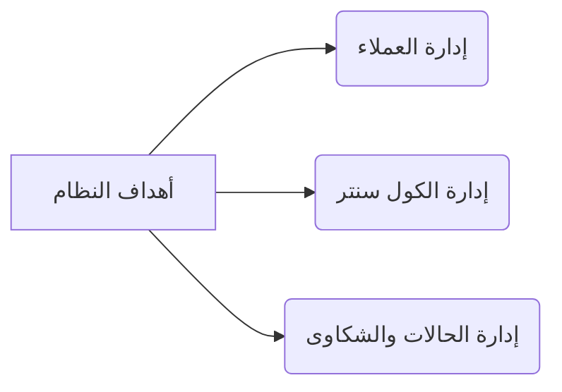
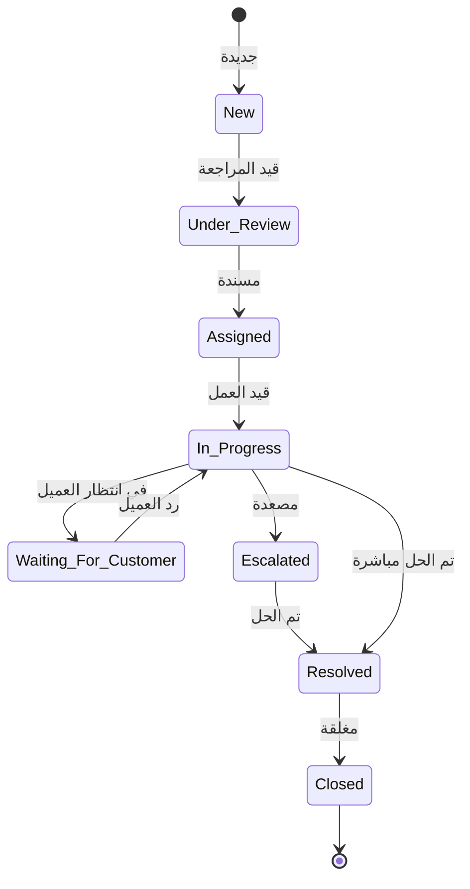

# دليل الشرح التفصيلي لنظام إدارة علاقات العملاء (CRM System)
## منصة خدمة العملاء، الكول سنتر، وإدارة الحالات والشكاوى

يحتوي هذا المستند على الشرح التفصيلي لجميع أركان ومميزات النظام ليكون مرجعاً شاملاً للمطورين والإداريين في أي وقت.

---

## 1. نظرة عامة على المشروع (Project Overview)

النظام ليس مجرد أداة لتسجيل البيانات، بل هو **محرك رئيسي لتنظيم دورة حياة خدمة ما بعد البيع بالكامل**.

> [!IMPORTANT]
> **قاعدة البيانات المعتمدة:** يتم بناء النظام بالاعتماد على قاعدة بيانات **Microsoft SQL Server** لضمان استقرار العلاقات، سرعة معالجة البيانات وتدقيق الحركات بشكل متكامل وآمن.

### مجالات العمل الثلاثة المتكاملة:
1. **خدمات ما بعد البيع:** إدارة اتصالات العملاء واستفساراتهم بكفاءة.
2. **الصيانة والدعم الفني:** تصليح الأجهزة وإرسال الفنيين وحل المشاكل التقنية.
3. **إدارة الوكلاء ومراكز الخدمة:** التنسيق بين الشركة وفروع الصيانة والوكلاء الخارجيين.

### الفائدة العملية للنظام:
بدل أن يكون عمل موظف خدمة العملاء معزولاً عن الفني في الورشة أو عن المخازن، يقوم هذا النظام بربط الجميع برابط رقمي واحد (**Single Source of Truth**). 
* *مثال:* بمجرد استقبال المكالمة، يعلم النظام الفني في المخزن أن هناك جهازاً يحتاج لقطعة غيار معينة، ويعلم الإدارة المالية بالتكلفة، كل ذلك بشكل آلي ومنظم دون تكرار أو تأخير.

---

## 2. الأهداف الرئيسية للمشروع (Main Objectives)

تنقسم الأهداف إلى ثلاث ركائز أساسية تدير العمل اليومي للشركة:

### أ. إدارة العملاء (Customer Management)
* **الفكرة:** لا يمكن تقديم خدمة ممتازة دون معرفة العميل. النظام يجب أن يحتفظ بملف موحد وثابت لكل عميل.
* **الأهمية:** عندما يتصل العميل، لا يجب على الموظف أن يسأله: "ما هو اسمك؟ ما هو جهازك؟ ما هي مشكلتك السابقة؟". كل هذه البيانات يجب أن تظهر فوراً. هذا يوفر وقت المكالمة ويشعر العميل باحترافية الشركة واهتمامها.

### ب. إدارة مركز الاتصال (Call Center Management)
* **الفكرة:** توثيق كل ثانية من التواصل.
* **الأهمية:**
  * **الربط التلقائي:** بمجرد رنين الهاتف، يطابق النظام الرقم بقاعدة البيانات ويفتح ملف العميل فوراً.
  * **التسجيل والتلخيص:** يكتب الموظف ملخصاً للمكالمة (مثال: *"العميل يشتكي من سخونة البطارية أثناء الشحن"*).
  * **أرشيف التسجيلات:** إمكانية الاستماع للمكالمة لاحقاً لحل النزاعات أو لتقييم جودة أداء الموظفين (Quality Assurance).

### ج. إدارة الحالات والشكاوى (Complaint & Case Management)
* **الفكرة:** تحويل المكالمة أو الشكوى إلى تذكرة عمل (**Ticket/Case**) لها رقم مرجعي فريد (مثل: `T-2026-0001`).
* **الأهمية:** التذكرة هي "الوثيقة القانونية" داخل الشركة التي تتنقل بين الأقسام. لا يمكن إغلاق التذكرة إلا بعد حل المشكلة وتأكيد العميل. هذا يضمن عدم نسيان أي مشكلة عميل أو ضياعها بين الإدارات.

---

## 3. الملف التعريفي للعميل (Customer Profile)

هو قلب قاعدة البيانات وينقسم إلى 3 أجزاء متكاملة:

### أ. البيانات الأساسية (Basic Information)
* **الاسم والهاتف والبريد:** للتواصل والتعريف الفردي للعميل.
* **رقم الواتساب:** وسيلة التواصل الأسرع اليوم لإرسال التنبيهات ورسائل الرضا والاستبيانات.
* **المحافظة والمدينة والعنوان:** **(مهمة جداً للصيانة)**، لأن النظام سيستخدم هذه البيانات لتوجيه طلبات الصيانة للفني القريب جغرافياً من العميل أو لمركز الخدمة المعتمد في محافظته تلقائياً.

### ب. بيانات الأجهزة والضمان (Device & Warranty Information)
الشركة تقدم صيانة ودعم فني لأجهزة، لذا يجب ربط الأجهزة بمالكيها:
* **موديل الجهاز ورقم الـ IMEI / السيريال:** لمنع التلاعب وتحديد الجهاز المصاب بدقة (خاصة في الهواتف أو الأجهزة الإلكترونية).
* **تاريخ الشراء ورقم الفاتورة:** لإثبات ملكية الجهاز ومكان الشراء.
* **فترة وحالة الضمان (ساري / منتهي):** هذه نقطة جوهرية؛ فإذا كان الضمان سارياً، فإن تكلفة الصيانة وقطع الغيار تكون مجانية على حساب الشركة. أما إذا كان منتهياً، فيقوم النظام تلقائياً بتحويل الحالة إلى **"خارج الضمان"** ويطلب تسعير الصيانة وقطع الغيار ليوافق عليها العميل مالياً أولاً قبل البدء بالإصلاح.

### ج. سجل العميل التاريخي (Customer History)
شريط زمني (Timeline) يعرض كل تفاعلات العميل منذ أول يوم تعامل فيه مع الشركة:
* كم مرة اتصل بنا؟ وماذا كانت المشاكل السابقة؟
* هل هناك أجهزة تم استبدالها له سابقاً؟
* ما هي ملاحظات الفنيين السابقين عنه؟ (مثال: *"العميل لا يتواجد في المنزل صباحاً"*).
* **ميزة هذا السجل:** إذا وجد الموظف أن العميل يشتكي من "مشكلة البطارية" للمرة الثالثة على نفس الجهاز، سيعرف فوراً أن هناك عيباً متكرراً يتطلب تصعيد الحالة فوراً للاستبدال بدلاً من الصيانة العادية.

---

## 4. رؤية العميل الموحدة والتعرف على المتصل (Customer 360° View & Caller ID)

هذه الميزة هي الفارق الأساسي بين الأنظمة القديمة والأنظمة الحديثة السريعة.

* **آلية العمل:**
  عندما يرن الهاتف لدى الموظف، يرسل السنترال (VoIP/IP-PBX) إشارة للنظام بالرقم المتصل. يقوم النظام فوراً بالبحث في قاعدة البيانات:
  * **إذا كان مسجلاً:** تظهر للموظف شاشة منبثقة (**Popup**) تحتوي على كل تفاصيل العميل قبل أن يفتح سماعة الهاتف حتى!
  * **إذا كان جديداً:** يفتح النظام نموذج "إنشاء عميل جديد" مع ملء خانة رقم الهاتف تلقائياً لتوفير الوقت.

* **مكونات شاشة الـ 360° View:**
  تعرض الشاشة معلومات العميل مقسمة بشكل ذكي دون تشتيت:
  1. **البيانات الشخصية السريعة:** لمعرفة اسم المتصل فوراً والترحيب به باسمه.
  2. **الأجهزة المسجلة باسمه:** لمعرفة الجهاز الذي يتصل بسببه (هل يتصل بخصوص الهاتف الذي اشتراه الشهر الماضي أم الجهاز القديم؟).
  3. **الحالات المفتوحة حالياً (Active Tickets):** إذا كان للعميل تذكرة صيانة مفتوحة حالياً، فالغالب أنه يتصل لمتابعتها. يعرض النظام التذكرة في الأعلى بوضوح ليخبره الموظف مباشرة: *"أهلاً بك يا فندم، هل تتصل لمتابعة طلب الصيانة الخاص بجهازك موديل X؟"* دون أن ينتظر العميل ليشرح كل شيء من جديد.

---

## 5. تصنيفات الاتصال والحالات (Call & Case Categories)

النظام لا يسمح للموظف بإدخال المشاكل بشكل عشوائي، بل يعتمد على شجرة تصنيفات منظمة (**Category Tree**) يحددها مدير النظام.

### الأقسام الرئيسية والتفريعات:
* **الدعم الفني:** مشكلة شاشة، مشكلة بطارية، مشكلة نظام تشغيل... إلخ.
* **خدمات ما بعد البيع:** طلب صيانة، طلب تفعيل ضمان، طلب استبدال جهاز.
* **الشكاوى:** شكوى ضد فني صيانة، شكوى من تأخر الشحن، شكوى من جودة الجهاز.
* **استفسارات عامة:** السؤال عن أسعار الأجهزة، أو أقرب فرع صيانة.

### أهمية التصنيف:
1. **التوجيه الآلي (Routing):** النظام يعلم تلقائياً أن أي حالة مصنفة "مشكلة شاشة/هاردوير" تذهب لقسم الصيانة، بينما "استفسار عن الأسعار" يذهب لقسم المبيعات.
2. **حساب مدة الحل (SLA):** شكوى العميل تتطلب حلاً خلال 24 ساعة، بينما الاستفسار العام يحتاج 4 ساعات فقط. التصنيف يحدد زمن الـ SLA فوراً.
3. **التقارير التحليلية:** يتيح للإدارة معرفة أكثر المشاكل تكراراً (مثال: *"هذا الشهر هناك 150 شكوى بخصوص بطارية الجهاز موديل Y"*، مما يشير لوجود عيب مصنعي يتطلب تدخل الإدارة).

---

## 6. إجراءات العمل وقاعدة المعرفة (Call Flow Guidance & Knowledge Base)

هذه الأداة بمثابة **"مساعد ذكي"** لكل موظف خدمة عملاء أثناء المكالمة لتوحيد جودة الخدمة.

* **المشكلة التي تحلها:**
  الموظفون الجدد قد لا يملكون الخبرة الكافية لتشخيص المشاكل الفنية، مما يجعلهم يقدمون إجابات خاطئة أو يقومون بتحويل حالات بسيطة للصيانة وهي لا تستدعي ذلك، مما يسبب تكلفة إضافية وضياع وقت.

* **آلية التطبيق:**
  بمجرد أن يختار الموظف تصنيف الحالة (مثال: *مشكلة شاشة - رعشة في الإضاءة*)، يعرض له النظام فوراً على جانب الشاشة بطاقة إرشادية تحتوي على:
  * **أسئلة للموظف لطرحها:** *"هل تظهر الرعشة أثناء الشحن فقط؟"*، *"هل قمت بتحديث النظام مؤخراً؟"*.
  * **خطوات التشخيص السريع (Troubleshooting):** *"اطلب من العميل الدخول للإعدادات ثم الشاشة وإيقاف السطوع التلقائي لتجربتها"*.
  * **الحلول الجاهزة:** إذا انحلت المشكلة بالخطوات السابقة، يقوم النظام بإغلاق التذكرة مباشرة كـ **"تم الحل في المكالمة الأولى" (First Call Resolution - FCR)**.
  * **شروط التصعيد:** *"إذا لم تُحل المشكلة وبقيت الرعشة مستمرة، قم بإنشاء طلب صيانة وحوّل التذكرة إلى قسم الصيانة"*.

---

## 7. دورة حياة التذكرة (Ticket Workflow)

التذكرة (Ticket) ليست مجرد حالة ثابتة، بل هي كيان حي يتنقل بين 8 مراحل محددة لضمان ألا تضيع أي شكوى:

### المراحل الثمانية:
1. **New (جديدة):** الحالة التلقائية عند إنشاء التذكرة لأول مرة.
2. **Under Review (قيد المراجعة):** يقوم رئيس الفريق أو الموجه بمراجعة التذكرة للتأكد من صحة البيانات.
3. **Assigned (تم الإسناد):** تم تعيين التذكرة لموظف أو فني بعينه للبدء في حلها.
4. **In Progress (قيد العمل):** بدأ الموظف فعلياً في العمل على حل المشكلة.
5. **Waiting For Customer (في انتظار العميل):** تم إيقاف العمل مؤقتاً لأننا نحتاج رد العميل. **(مهم جداً: في هذه المرحلة يتم إيقاف عدّاد الـ SLA مؤقتاً حتى لا يُحسب وقت تأخر العميل ضد الموظف)**.
6. **Escalated (مُصعّدة):** إذا تجاوزت الوقت المحدد أو واجهت مشكلة معقدة تتطلب تدخل مستوى إداري أعلى.
7. **Resolved (تم الحل):** تم إنهاء العمل وحل المشكلة تقنياً.
8. **Closed (مغلقة):** الاتصال بالعميل للتأكد من رضائه وإغلاق التذكرة نهائياً.

### ما يتم تسجيله في الخلفية مع كل حركة:
* **من** الذي قام بالتغيير؟ (اسم المستخدم).
* **متى** تم التغيير؟ (بالساعة والدقيقة والثانية).
* **زمن البقاء (Duration):** حساب الوقت الذي قضته التذكرة في كل مرحلة بدقة لتقييم الكفاءة.

---

## 8. توجيه الحالات بين الإدارات (Department Routing)

لا تعمل خدمة العملاء بمفردها، فالمشكلة الفنية تحتاج فني، والاستبدال يحتاج مخازن، والتعويض المالي يحتاج حسابات.

* **آلية التوجيه (Routing Logic):**
  يسمح النظام بتحويل التذكرة بسلاسة بين الإدارات:
  *(خدمة العملاء -> الدعم الفني/الصيانة -> الضمان -> المخازن -> اللوجستيات -> المالية)*.
* **الشفافية وتتبع السجل (History Tracking):**
  يحفظ النظام سجلاً كاملاً للتحويلات: *"تم تحويل التذكرة من الدعم الفني إلى المخازن بواسطة الموظف (أحمد) للطلب رقم (x) لقطع الغيار"*. هذا يمنع إلقاء اللوم بين الأقسام.

---

## 9. إدارة التصعيد (Escalation Management)

عند تأخر حل المشكلة أو وجود حالة طارئة، يتم تفعيل نظام التصعيد التلقائي أو اليدوي لضمان عدم بقاء التذكرة معلقة.

### مستويات التصعيد (Escalation Levels):
* **المستوى 1:** موظف خدمة العملاء العادي (Agent).
* **المستوى 2:** رئيس الفريق (Team Leader) - يتم التصعيد له إذا مر 50% من الـ SLA دون حل.
* **المستوى 3:** مدير القسم (Department Manager) - يتلقى التذكرة عند انتهاء SLA بالكامل دون حل.
* **المستوى 4:** الإدارة العليا (Executive Management) - للحالات الحرجة جداً أو الشكاوى القانونية.

### شروط وضوابط التصعيد:
* **تصعيد تلقائي بالوقت:** إذا مرت 12 ساعة على شكوى (مهلة SLA = 24 ساعة) دون تغيير حالتها إلى "In Progress"، يقوم النظام بتصعيدها للمستوى 2 وإخطار رئيس الفريق.
* **تصعيد يدوي:** للموظف الحق في تصعيد التذكرة يدوياً إذا وجد العميل غاضباً جداً أو هدد باللجوء لحماية المستهلك.
* **الإشعارات المصاحبة:** إرسال إشعار فوري (نظام داخلي، بريد إلكتروني، أو WhatsApp) للمسؤول الجديد فور حدوث التصعيد.

---

## 10. اتفاقية مستوى الخدمة (SLA Management)

الـ SLA هي العهد الذي تقطعه الشركة على نفسها لحل مشكلة العميل في وقت محدد.

### تحديد مدد الحل حسب نوع التذكرة:
* **استفسار عام:** 4 ساعات عمل (لأن الرد جاهز).
* **شكوى:** 24 ساعة عمل (تتطلب بحثاً عاجلاً لحماية سمعة الشركة).
* **طلب ضمان:** 48 ساعة عمل (تتطلب فحص توافق شروط الضمان).
* **طلب صيانة وإصلاح:** 72 ساعة عمل (فحص وتوفير قطع الغيار والإصلاح الفعلي).

### مفهوم "ساعات العمل" (Working Hours):
النظام الذكي يحتسب ساعات العمل الفعلية للشركة فقط (مثلاً من 9 صباحاً إلى 5 مساءً) ويستثني العطلات الأسبوعية والإجازات الرسمية. فإذا تم فتح تذكرة قبل نهاية العمل بدقيقة، يتوقف العداد ويستأنف صباح اليوم التالي.

### المؤشرات التي يقيسها النظام للإدارة (KPIs):
* **نسبة الالتزام بالـ SLA:** كم تذكرة تم حلها في الوقت المحدد؟
* **متوسط زمن الحل (MTTR):** متوسط الوقت المستغرق لإغلاق التذاكر.
* **زمن الاستجابة الأولية (FRT):** الوقت المستغرق لأول رد على العميل.

---

## 11. الملاحظات الداخلية والمرفقات (Internal Notes & Attachments)

تتطلب التذاكر تعاوناً وثيقاً بين الموظفين، والتذكرة هي المكان الوحيد لهذا النقاش.

* **الملاحظات الداخلية (Internal Notes):**
  * تعليقات يكتبها الموظفون لبعضهم البعض وتكون **مخفية تماماً عن العميل**.
  * *مثال:* يكتب الفني: *"الجهاز به آثار رطوبة وماء قد تؤدي لإلغاء الضمان، أرجو من خدمة العملاء التواصل مع العميل للتأكيد"* دون أن يرى العميل هذا التعليق في تتبع الحالة.
* **المرفقات (Attachments):**
  * رفع صور للجهاز المتضرر لإثبات حالته (وجود خدوش أو كسر).
  * رفع ملف PDF (مثل الفاتورة أو وثيقة الضمان) والاحتفاظ بها كمرجع فني وقانوني.

---

## 12. نظام البحث المتقدم (Advanced Search System)

البحث السريع يقلل من وقت المكالمة ويزيد من رضا العميل.

* **البحث الشامل والمفهرس:**
  البحث الفوري في قاعدة البيانات باستخدام: *رقم الهاتف، رقم التذكرة، رقم الـ IMEI أو السيريال، رقم الفاتورة، الاسم، أو البريد الإلكتروني*.
* **البحث الجزئي (Wildcard Search):**
  كتابة جزء من الاسم أو آخر 4 أرقام من الهاتف يعرض قائمة بالنتائج المطابقة فوراً دون الحاجة لكتابة الاسم كاملاً.

---

## 13. لوحة التحكم والإحصائيات اللحظية (Real-time Dashboards)

شاشات حية ومحدثة تلقائياً لمراقبة سير العمل:
* **لوحة الكول سنتر:** المكالمات اليومية، أسباب الاتصال الأكثر تكراراً، والموظفين المتاحين حالياً.
* **لوحة الحالات:** عدادات التذاكر المفتوحة والمغلقة، وإظهار الحالات المتأخرة (Overdue) باللون الأحمر للتنبيه الفوري.
* **لوحة أداء الإدارات:** حجم الضغط والعمل (Workload) على كل إدارة لمعرفة أين تقع الاختناقات.

---

## 14. التقارير والتحليلات (Reports & Analytics)

تركز التقارير على دراسة البيانات التاريخية لتحسين جودة الأعمال:
* **تقارير الأجهزة والعملاء:** تحديد الموديلات الأكثر عطلاً ونوعية الأعطال المتكررة للمناقشة مع المصنع أو الوكلاء.
* **تقارير أداء الموظفين (Agent KPIs):** كم حالة حلها الموظف ومعدل رضا العملاء عنه ومتوسط زمن الاستجابة.
* **تقارير التزام الإدارات:** قياس كفاءة الأقسام ومدى التزامها بمدد الـ SLA.

---

## 15. نظام الإشعارات والتنبيهات (Notifications Engine)

بمثابة المحرك الذي يضمن تحرك التذاكر دون إهمال ويحافظ على تواصل العميل:
* **محفزات الإرسال:** عند إنشاء تذكرة، تحويلها، إرسال تحذير بقرب انتهاء SLA، أو إغلاق التذكرة.
* **القنوات المدعومة:**
  * إشعارات النظام الداخلية (In-App) للموظفين.
  * البريد الإلكتروني (Email) للتقارير والمراسلات الرسمية.
  * رسائل WhatsApp أو SMS للعملاء (مثل: *"تم الانتهاء من صيانة جهازك وهو جاهز للاستلام"*).

---

## 16. قياس رضا العملاء (Customer Satisfaction - CSAT)

الخطوة النهائية لقياس نجاح الخدمة المقدمة.

* **آلية العمل:** بعد إغلاق التذكرة بربع ساعة، يرسل النظام تلقائياً رابط استبيان للعميل عبر WhatsApp أو البريد.
* **مكونات الاستبيان:** تقييم الخدمة الإجمالي (نجوم)، تقييم السرعة، تقييم تعامل الموظف، ومساحة للملاحظات.
* **التحليلات المستفادة:** تقييم الموظفين والأقسام بناءً على رضا العملاء، وتتبع مستوى تحسن الخدمة شهرياً.

---

## 17. الصلاحيات وأدوار المستخدمين (User Roles & Permissions)

توزيع الأدوار يضمن سرية البيانات وحمايتها:
1. **موظف خدمة العملاء (Agent):** إنشاء وتحديث التذاكر وتسجيل المكالمات، ولا يمكنه حذف البيانات أو تعديل الـ SLA.
2. **رئيس الفريق (Team Leader):** مراجعة تذاكر فريقه، إعادة التوزيع، الموافقة على التصعيد، ومتابعة الأداء.
3. **موظف القسم المختص (Department User):** معالجة الحالات المحولة لقسمه فقط دون الاطلاع على باقي النظام.
4. **مدير القسم المختص (Department Manager):** متابعة إحصائيات قسمه، وإعطاء استثناءات خاصة بالصيانة والضمان.
5. **مسؤول النظام (Admin):** التحكم الكامل بالنظام (إضافة موظفين، تعديل الصلاحيات، ضبط مدد الـ SLA وقاعدة المعرفة).

---

## 18. سجل التدقيق والأمان (Audit Trail)

هو الصندوق الأسود للنظام لتسجيل كل نشاط لضمان الأمان والشفافية.

* **ما يتم تسجيله:** نوع العملية (إنشاء، تعديل، حذف...)، هوية المستخدم، الطابع الزمني بالثانية، والقيمة القديمة والجديدة (Before & After).
* *مثال عملي:* عند اعتراض عميل على إغلاق تذكرته دون حل، يراجع المدير سجل التذكرة ليرى: *"قام الموظف أحمد بتغيير حالة التذكرة من قيد العمل إلى مغلقة يوم 29-06-2026 الساعة 10:15 صباحاً"* لمعرفة المتسبب ومحاسبته.

---

## 19. إضافات وميزات مقترحة (Proposed Enhancements - مقترحات المستخدم)

> [!IMPORTANT]
> تمثل هذه النقاط السبعة الإضافية رؤية المستخدم لتطوير النظام ونقله إلى مستوى ذكاء وكفاءة أعلى لدعم العمليات وتوفير آلاف الساعات من العمل اليدوي:

### 1. بوابة تتبع الخدمة الذاتية للعملاء (Customer Self-Service Portal)
* **الفكرة:** صفحة ويب بسيطة ومخصصة للعملاء (أشبه بصفحة تتبع الشحنات).
* **الفائدة العملية:** يكتب العميل رقم هاتفه ورقم التذكرة أو الـ IMEI ليعرف حالة جهازه فوراً (مثل: *قيد الفحص*، *بانتظار الموافقة المالية*، *جاهز للاستلام*).
* **الأهمية لمركز الاتصال:** يقلل مكالمات الاستفسار المعتادة عن حالة الأجهزة بنسبة قد تصل إلى **40%**، مما يوفر وقت الموظفين للمكالمات الطارئة.

---

### 2. المساعد الذكي بالذكاء الاصطناعي (AI Copilot for Agents)
* **الفكرة:** إدماج نموذج ذكاء اصطناعي خفيف للمساعدة الفورية لموظفي الدعم وخدمة العملاء.
* **الفائدة العملية:**
  * **التلخيص التلقائي:** بمجرد انتهاء المكالمة، يقوم الذكاء الاصطناعي بتلخيص ما تم كتابته بشكل احترافي ومنظم وتصنيف التذكرة تلقائياً.
  * **اقتراحات الحلول:** قراءة نص المشكلة واقتراح الحل الأقرب فوراً من قاعدة المعرفة لتسريع عملية الرد وتوجيه الموظف.
  * **تحليل الغضب (Sentiment Analysis):** تحليل نبرة كلام العميل أو رسائله لتحديد مدى غضبه وتنبيه المشرفين للتدخل السريع.

---

### 3. نظام فرعي لإدارة قطع الغيار والمخازن (Mini-Inventory System)
* **الفكرة:** ربط عملية صيانة الأجهزة بقطع الغيار والمخزون المتوفر.
* **الفائدة العملية:**
  * عند تحديد العطل (مثل: *شاشة تالفة*)، يظهر للنظام فوراً هل الشاشة متوفرة في مخزن هذا الفرع أم لا.
  * **الحجز التلقائي:** إذا كانت متوفرة، يتم حجز القطعة لصالح التذكرة فوراً (Reserved).
  * **طلب التوريد:** إذا لم تكن متوفرة، ينشئ النظام طلباً تلقائياً للمخزن الرئيسي (Spare Part Request) لتسريع الإمداد وتتبع تكلفة قطع الغيار مع كل تذكرة.

---

### 4. واجهة الفنيين الميدانيين (Field Service Mobile UI)
* **الفكرة:** واجهة مستخدم متوافقة مع الهواتف الذكية تخدم الفنيين الذين يقومون بزيارات صيانة منزلية (للأجهزة الكبيرة كالغسالات والشاشات).
* **الفائدة العملية:**
  * يعرض للفني جدول زياراته اليومي مرتباً جغرافياً ومرتبطاً بـ (Google Maps) لتسهيل الوصول للعملاء.
  * يتيح للفني كتابة تقرير الصيانة، ورفع صور العطل قبل وبعد التصليح، وجعل العميل **يوقع إلكترونياً بإصبعه على شاشة الهاتف** لتأكيد استلام وفحص الجهاز.

---

### 5. نظام التوزيع العادل للتذاكر (Round-Robin & Workload Routing)
* **الفكرة:** توزيع آلي للتذاكر والحالات على الموظفين المتاحين.
* **الفائدة العملية:**
  * يمنع توزيع العمل العشوائي أو التحيز اليدوي.
  * يقوم النظام بتوزيع المهام الجديدة بالتناوب على الموظفين النشطين (Round-Robin)، أو يعطي الأولوية للموظف الذي لديه أقل عدد من المهام قيد التنفيذ (Workload-based) لضمان بيئة عمل متوازنة.

---

### 6. دمج قنوات المحادثات الموحدة (Omnichannel Integration)
* **الفكرة:** تجميع رسائل (الواتساب، الفيسبوك ماسنجر، والدردشة المباشرة للموقع) في شاشة شات واحدة داخل الـ CRM تُسمى **صندوق الوارد المشترك (Shared Inbox)**.
* **آلية العمل:**
  * يرد الموظف على الرسائل من داخل النظام مباشرة، ويصل الرد للعميل على نفس التطبيق الذي راسلنا منه.
  * **التذكرة بضغطة زر (Chat-to-Ticket):** بضغطة زر واحدة داخل الشات، يقوم النظام بالتعرف على العميل من رقم هاتفه، ويسحب نص المشكلة من الشات تلقائياً لإنشاء تذكرة صيانة رسمية وإرسال رقمها للعميل في نفس اللحظة.

---

### 7. بوابة الوكلاء ومراكز الصيانة الخارجية (Subcontractor/Dealer Portal)
* **الفكرة:** لوحة تحكم مخصصة للورش الخارجية أو الوكلاء المعتمدين الذين تتعاقد معهم الشركة لصيانة الأجهزة.
* **الفائدة العملية:**
  * يرى الوكيل فقط الحالات التي قمنا بتحويلها له ولا يرى قاعدة البيانات بالكامل.
  * يمكنه تحديث حالة الصيانة للجهاز وطلب قطع الغيار اللازمة وتأكيد تسليم الجهاز للعميل من خلال بوابته الخاصة، مما يتيح تتبعاً كاملاً لأدائهم وجودة عملهم.

