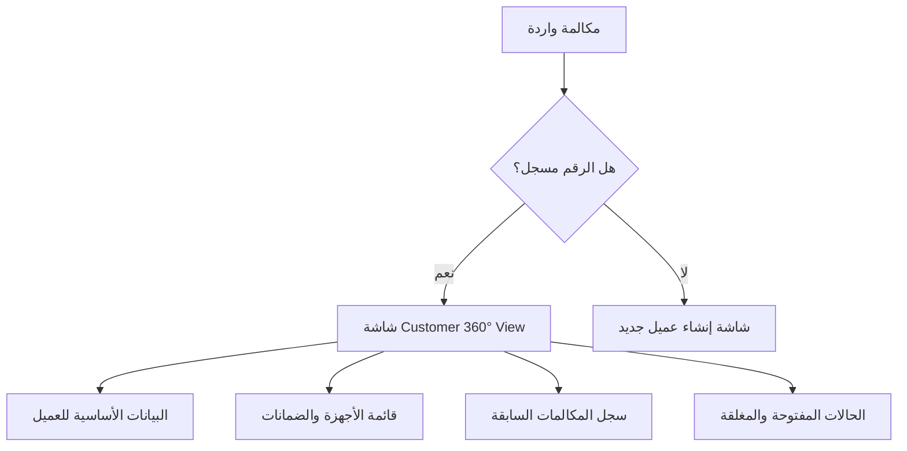
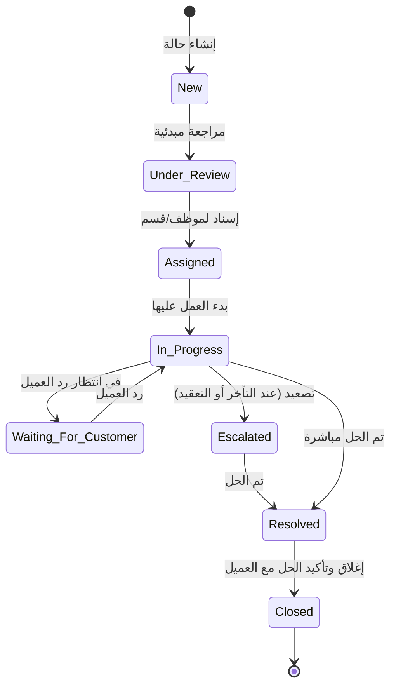

# متطلبات نظام إدارة علاقات العملاء (CRM System Requirements)
## منصة خدمة العملاء، الكول سنتر، وإدارة الحالات (Customer Service, Call Center & Case Management Platform)

---

## 1. نظرة عامة على المشروع (Project Overview)
يهدف النظام إلى أتمتة وإدارة جميع تفاعلات العملاء مع الشركة من لحظة استقبال المكالمة وحتى حل المشكلة وإغلاقها. يوفر النظام حلاً متكاملاً لمتابعة الحالات (Tickets)، تحليل الأداء، وإعداد تقارير تفصيلية لدعم اتخاذ القرار.

> [!IMPORTANT]
> **قاعدة البيانات المعتمدة:** يتم بناء النظام بالاعتماد على قاعدة بيانات **Microsoft SQL Server** لضمان استقرار العلاقات، سرعة معالجة البيانات وتدقيق الحركات بشكل متكامل وآمن.

### مجالات عمل الشركة الأساسية:
* **خدمات ما بعد البيع (After-Sales Services)**.
* **الصيانة والدعم الفني (Maintenance & Technical Support)**.
* **إدارة الوكلاء ومراكز الخدمة (Service Centers & Agent Management)**.

> [!NOTE]
> **شرح تفصيلي للتشغيل والفائدة العمليّة:**
> الهدف الأساسي هنا ليس مجرد برنامج لتسجيل البيانات، بل هو **محرك لتنظيم دورة حياة خدمة ما بعد البيع بالكامل**. يربط النظام بين موظفي خدمة العملاء والفنيين في الورش والمخازن والإدارة المالية في حلقة رقمية واحدة (Single Source of Truth). على سبيل المثال: بمجرد فتح تذكرة صيانة، يعلم النظام الفني في المخزن بقطع الغيار المطلوبة، ويبلغ الحسابات بالتكلفة، ويحدث حالة الضمان، كل ذلك بشكل آلي لمنع ضياع البيانات أو تأخر الخدمة.

---

## 2. الأهداف الرئيسية (Main Objectives)

### أ. إدارة العملاء (Customer Management) - [مكتمل ✅]
* إنشاء ملف تعريفي كامل لكل عميل.
* حفظ وتحديث بيانات التواصل.
* عرض سجل التعاملات التاريخية بالكامل في مكان واحد.
* تتبع الأجهزة المملوكة للعميل وحالة الضمان الخاصة بكل منها.
* تتبع سجل الشكاوى والطلبات السابقة.

> [!NOTE]
> **شرح تفصيلي وفائدة تجارية:**
> الاحتفاظ بملف موحد يمنع الموظف من تكرار الأسئلة التقليدية للعميل في كل اتصال (مثل: ما اسمك؟ ما هو جهازك؟ ما هي مشكلتك السابقة؟). هذا يوفر وقت المكالمة، ويمنح العميل شعوراً باحترافية الشركة واهتمامها، مما يرفع من نسبة الولاء.

### ب. إدارة مركز الاتصال (Call Center Management) - [مكتمل ✅]
* تسجيل المكالمات الصادرة والواردة.
* ربط المكالمة تلقائياً بملف العميل عند التعرف على رقمه.
* تدوين ملخص المكالمة وتصنيف سبب الاتصال.
* إمكانية رفع وإرفاق تسجيل المكالمة الصوتي.

> [!NOTE]
> **شرح تفصيلي وفائدة تجارية:**
> توثيق كل ثانية من التواصل يحمي حقوق الشركة والعميل. الربط التلقائي يفتح ملف العميل فوراً عند رنين الهاتف. كما أن الاحتفاظ بأرشيف التسجيلات الصوتية يساعد في حل أي نزاعات أو شكاوى ويستخدم لتدريب الموظفين وتقييم جودتهم (Quality Assurance).

### ج. إدارة الحالات والشكاوى (Complaint & Case Management) - [مكتمل ✅]
* إنشاء حالة (Case / Ticket) فريدة لكل طلب أو شكوى برقم مرجعي تلقائي.
* متابعة دورة حياة الحالة خطوة بخطوة.
* تحديد المسؤول الحالي عن معالجة الحالة.
* توثيق جميع التحديثات والإجراءات المتخذة.
* إغلاق الحالة بعد التأكد من الحل وتوثيق النتيجة النهائية.

> [!NOTE]
> **شرح تفصيلي وفائدة تجارية:**
> التذكرة هي "وثيقة العمل الرسمية" داخل الشركة التي تتنقل بين الأقسام. لا يمكن إغلاق التذكرة إلا بعد تأكيد الحل الفعلي مع العميل وتوثيق النتيجة. هذا يضمن عدم إهمال أو نسيان أي طلب أو شكوى.

---

## 3. الملف التعريفي للعميل (Customer Profile) - [مكتمل ✅]

يحتوي ملف العميل على ثلاثة أقسام رئيسية:

### أ. البيانات الأساسية (Basic Information)
* **الاسم الكامل**
* **رقم الهاتف الأساسي** (للتعرف التلقائي على المتصل)
* **رقم واتساب** (لإرسال التنبيهات والاستبيانات التلقائية)
* **البريد الإلكتروني** (للمراسلات الرسمية)
* **المحافظة والمدينة والعنوان التفصيلي**

> [!NOTE]
> **ملاحظة تشغيلية هامة:**
> تحديد المحافظة والمدينة بدقة أمر حيوي لإدارة الصيانة؛ حيث يستخدمه النظام لتوجيه طلبات الصيانة للفنيين القريبين جغرافياً أو لمركز الخدمة المعتمد في تلك المحافظة بشكل آلي ودون تدخل بشري.

### ب. بيانات الأجهزة والضمان (Device & Warranty Information)
* **موديل الجهاز (Device Model)**
* **رقم الـ IMEI** (معرف الجهاز الفريد لمنع التلاعب)
* **الرقم التسلسلي (Serial Number)** إن وجد
* **تاريخ الشراء ورقم الفاتورة**
* **فترة وحالة الضمان (Warranty Status)** (ساري / منتهي)

> [!NOTE]
> **ملاحظة تشغيلية هامة:**
> حالة الضمان تحدد مسار التذكرة مالياً:
> * **ضمان ساري:** تكلفة الصيانة وقطع الغيار تكون مجانية على حساب الشركة.
> * **ضمان منتهي:** يحول النظام الحالة إلى "خارج الضمان" ويطلب تسعير قطع الغيار ليوافق عليها العميل مالياً أولاً قبل البدء بالإصلاح.

### ج. سجل العميل التاريخي (Customer History)
* سجل المكالمات السابقة وملخصاتها.
* سجل الشكاوى والحالات السابقة.
* طلبات الصيانة وتفاصيلها وطلبات الاستبدال والضمان.
* جميع الملاحظات والتفاعلات السابقة.

> [!NOTE]
> **ملاحظة تشغيلية هامة:**
> هذا الشريط الزمني (Timeline) يساعد الموظف على اكتشاف المشاكل المتكررة. فمثلاً، إذا وجد الموظف أن العميل يشتكي من "البطارية" للمرة الثالثة لنفس الجهاز، يعلم فوراً أن هناك عيباً متكرراً يتطلب تصعيد الحالة للاستبدال بدلاً من الصيانة العادية.

---

## 4. رؤية العميل الموحدة والتعرف على المتصل (Customer 360° View & Caller ID) - [مكتمل ✅]

عند استقبال مكالمة من عميل مسجل، يتعرف النظام عليه تلقائياً عبر رقم الهاتف ويعرض شاشة موحدة تحتوي على:

### محتويات الشاشة الموحدة:
1. **البيانات الشخصية:** الاسم، رقم الهاتف، البريد، العنوان، وتاريخ أول تعامل.
2. **الأجهزة المسجلة:** قائمة بكل جهاز يملكه (الموديل، IMEI، حالة الضمان).
3. **تاريخ التفاعل:** آخر المكالمات، ملخصها، واسم الموظف المسؤول عنها.
4. **الحالات والشكاوى:** عرض الحالات النشطة (Open Cases)، الحالات المغلقة (Closed)، وطلبات الصيانة والاستبدال السابقة.

> [!NOTE]
> **شرح تفصيلي للتشغيل:**
> بمجرد رنين الهاتف، يرسل السنترال إشارة للنظام بالرقم المتصل. إذا كان العميل مسجلاً، تنبثق شاشة الـ 360° View فوراً أمام الموظف قبل فتح السماعة. تظهر التذاكر النشطة (Open Tickets) في الأعلى بوضوح ليتمكن الموظف من مبادرة العميل بالسؤال: *"أهلاً بك يا فندم، هل تتصل لمتابعة طلب الصيانة الخاص بجهازك؟"* دون أن يضطر العميل لشرح موقفه مجدداً.

---

## 5. تصنيفات الاتصال والحالات (Call & Case Categories) - [مكتمل ✅]

ينقسم الاتصال أو الحالة إلى عدة تصنيفات رئيسية وتفريعاتها:

### أ. الدعم الفني (Technical Support)
* مشكلة تشغيل / مشكلة بطارية / مشكلة شاشة / مشكلة شبكة / مشكلة تحديثات وأنظمة التشغيل.

### ب. خدمات ما بعد البيع (After Sales)
* طلب صيانة / طلب ضمان / طلب استبدال.

### ج. الشكاوى (Complaints)
* شكوى من مستوى الخدمة / شكوى من جودة المنتج / شكوى ضد مركز الصيانة.

### د. استفسارات عامة (General Inquiries)
* استفسار عام / متابعة حالة أو تذكرة سابقة.

> [!NOTE]
> **شرح تفصيلي للتشغيل:**
> شجرة التصنيفات (Category Tree) يجب أن تكون مرنة وقابلة للتعديل والإضافة من لوحة التحكم (Admin). أهميتها تكمن في:
> 1. **التوجيه الآلي (Routing):** تحديد القسم المستلم للحالة تلقائياً.
> 2. **حساب الـ SLA:** تحديد المهلة الزمنية للحل بناءً على نوع المشكلة.
> 3. **التقارير التحليلية:** تحديد العيوب المتكررة في المنتجات (مثل كثرة الشكاوى من بطارية موديل معين).

---

## 6. إجراءات المكالمة وقاعدة المعرفة (Call Flow Guidance & Knowledge Base) - [⏳ لم يبدأ بعد]

عندما يختار الموظف تصنيف المشكلة أثناء المكالمة، يقوم النظام بعرض محتوى إرشادي تفاعلي من قاعدة المعرفة لمساعدة الموظف:
* **الأسئلة المطلوب طرحها:** لتشخيص المشكلة بدقة.
* **خطوات التشخيص السريع:** خطوات يتبعها العميل عبر الهاتف لحل المشكلة فوراً (FCR).
* **الحلول الجاهزة المقترحة:** الإجابات النموذجية.
* **شروط التصعيد:** متى يجب إنشاء تذكرة وتوجيهها لإدارة أخرى.

> [!NOTE]
> **شرح تفصيلي للتشغيل:**
> هذه الأداة تعمل كـ "مساعد ذكي" يوحد جودة الخدمة. الموظفون الجدد يتبعون نفس خطوات الفحص الاحترافية التي يتبعها أصحاب الخبرة. إذا تم حل المشكلة أثناء المكالمة بناءً على الإرشادات، تُغلق التذكرة فوراً كـ "تم الحل في المكالمة الأولى" (First Call Resolution)، مما يوفر تكلفة الصيانة والانتقال.

---

## 7. دورة حياة التذكرة (Ticket Workflow) - [مكتمل ✅]

تمر الحالة بالمراحل التالية لضمان المتابعة وحساب أوقات الإنجاز:

### البيانات المسجلة مع كل انتقال:
* تاريخ ووقت الانتقال الفعلي بين الحالات، واسم المستخدم، وزمن البقاء في كل مرحلة، والملاحظات المرفقة.

> [!NOTE]
> **شرح تفصيلي للتشغيل:**
> كل تحديث أو نقل للحالة يتم حسابه بالثانية. 
> * **ملاحظة هامة:** عند تحويل التذكرة إلى حالة **Waiting For Customer** (في انتظار العميل لإرسال الفاتورة أو تأكيد موعد مثلاً)، يقوم النظام **بإيقاف عدّاد الـ SLA مؤقتاً** لكي لا يُحسب وقت تأخر العميل ضد كفاءة الموظف.

---

## 8. توجيه الحالات بين الإدارات (Department Routing) - [مكتمل ✅]

يسمح النظام بتحويل الحالات بين الإدارات المختلفة مع تتبع كامل لسجل التحويلات.
* **الإدارات:** خدمة العملاء، الدعم الفني، الصيانة، الضمان، المبيعات، المخازن، اللوجستيات، الإدارة القانونية، الإدارة المالية.

> [!NOTE]
> **شرح تفصيلي للتشغيل:**
> التوجيه يتم تلقائياً بناءً على نوع التذكرة أو يدوياً بواسطة المشرف. يحتفظ النظام بسجل كامل للتحويلات: (تم النقل من قسم X إلى قسم Y بواسطة الموظف Z في وقت كذا مع كتابة السبب). هذا يمنع ظاهرة "التهرب من المسؤولية" ويضمن الشفافية والتعاون التام بين الأقسام.

---

## 9. إدارة التصعيد (Escalation Management) - [مكتمل ✅]

عند تأخر حل التذكرة أو وجود شكوى حرجة، يتم تفعيل نظام التصعيد التلقائي أو اليدوي:

### مستويات التصعيد:
* **المستوى 1 (Agent):** موظف خدمة العملاء.
* **المستوى 2 (Team Leader):** رئيس الفريق.
* **المستوى 3 (Department Manager):** مدير القسم.
* **المستوى 4 (Executive Management):** الإدارة العليا.

> [!NOTE]
> **شرح تفصيلي للتشغيل:**
> 1. **تصعيد تلقائي بالوقت:** إذا مرت 50% من مهلة الـ SLA ولم يتم البدء بالحل، يتم التصعيد للمستوى 2. وإذا انتهت المهلة بالكامل دون حل، يتم التصعيد تلقائياً للمستوى 3 مع إرسال تنبيه للمدير.
> 2. **تصعيد يدوياً:** يحق للموظف تصعيد التذكرة يدوياً في الحالات الطارئة أو غضب العميل الشديد أو وجود تهديد باللجوء لحماية المستهلك.
> 3. **التنبيهات:** يتم إرسال إشعارات فورية عبر النظام والبريد الإلكتروني للمسؤول الجديد عند حدوث التصعيد لسرعة التدخل.

---

## 10. اتفاقية مستوى الخدمة (SLA Management) - [مكتمل ✅]

يتم تحديد أزمنة مستهدفة لمعالجة كل تذكرة بناءً على تصنيفها لضمان سرعة الخدمة:

| تصنيف الحالة | المهلة المستهدفة للحل (SLA Resolution Time) |
| :--- | :--- |
| **استفسار عام** | 4 ساعات عمل |
| **شكوى خدمة أو منتج** | 24 ساعة عمل |
| **طلب ضمان** | 48 ساعة عمل |
| **طلب صيانة وإصلاح** | 72 ساعة عمل |

> [!NOTE]
> **شرح تفصيلي للتشغيل:**
> * **ساعات العمل الرسمية:** النظام يحتسب ساعات العمل الفعلية للشركة فقط (مثلاً من 9 صباحاً إلى 5 مساءً) ويستثني العطلات الأسبوعية والإجازات الرسمية لضمان دقة الحساب.
> * **مؤشرات الأداء (KPIs):** يقيس النظام نسبة الالتزام بالـ SLA لكل قسم وموظف، عدد الحالات المتأخرة (Overdue)، متوسط زمن الحل (MTTR)، ومتوسط زمن الاستجابة الأولية (First Response Time).

---

## 11. الملاحظات الداخلية والمرفقات (Internal Notes & Attachments) - [مكتمل ✅]
* **ملاحظات داخلية:** تبادل المعلومات والتعليق داخل التذكرة بين الموظفين دون أن يراها العميل.
* **المرفقات:** رفع صور الأجهزة، فواتير الشراء، مستندات الضمان، وملفات الـ PDF.

> [!NOTE]
> **شرح تفصيلي للتشغيل:**
> الملاحظات الداخلية تساعد في الحفاظ على سرية النقاش التقني (مثال: يكتب الفني تعليقاً داخلياً: *"الجهاز به آثار رطوبة قد تلغي الضمان، يرجى مراجعة الإدارة"* دون أن يظهر ذلك للعميل في شاشة التتبع الخاصة به). المرفقات تدعم توثيق حالة الأجهزة بالصور قبل وبعد الصيانة كمرجع قانوني عند الحاجة.

---

## 12. نظام البحث المتقدم (Advanced Search System) - [مكتمل ✅]
إمكانية البحث السريع والفلترة المتقدمة عن العملاء والحالات باستخدام:
* رقم الهاتف، اسم العميل، رقم التذكرة، IMEI، السيريال، رقم الفاتورة، أو البريد الإلكتروني.

> [!NOTE]
> **شرح تفصيلي للتشغيل:**
> يتم فهرسة قاعدة البيانات (Indexing) لضمان ظهور النتائج في أجزاء من الثانية أثناء المكالمة المباشرة. يدعم النظام البحث الجزئي (Partial Search)، فكتابة آخر 4 أرقام من الهاتف أو جزء من الاسم تعرض فوراً قائمة بالنتائج المطابقة للموظف.

---

## 13. لوحة التحكم والإحصائيات (Real-time Dashboards) - [⏳ لم يبدأ بعد]

لوحة تحكم تفاعلية ومحدثة لحظياً تعرض مؤشرات الأداء الرئيسية (KPIs) للإدارات:
* **لوحة الكول سنتر:** المكالمات اليومية الكلية وتوزيعها حسب التصنيف والموظفين المتاحين.
* **لوحة الحالات:** التذاكر المفتوحة والمغلقة، والحالات المتأخرة أو المصعدة باللون الأحمر لتنبيه المسؤولين.
* **لوحة الإدارات:** حجم العمل الحالي (Workload) لكل قسم والتذاكر المعلقة لديهم لموازنة الجهود.

> [!NOTE]
> **شرح تفصيلي للتشغيل:**
> شاشة حية يتم تحديثها تلقائياً بدون الحاجة لإعادة تحميل الصفحة. تمنح المشرفين والمديرين رؤية فورية وشاملة لمسار العمل وتكشف الاختناقات (Bottlenecks) في الأقسام المختلفة للتدخل السريع.

---

## 14. التقارير والتحليلات (Reports & Analytics) - [⏳ لم يبدأ بعد]

إمكانية استخراج تقارير دورية مصنفة كالتالي:
* **تقارير الأجهزة:** الأعطال المتكررة وموديلات الأجهزة الأكثر تعرضاً للمشكلات.
* **تقارير المكالمات:** أوقات الذروة وتوزيع الاتصالات الشهري.
* **تقارير الموظفين والإدارات:** حجم الإنجاز، متوسط زمن الحل، ونسبة التزام الأقسام بـ SLA.

> [!NOTE]
> **شرح تفصيلي للتشغيل:**
> مخصصة للتحليل طويل المدى (أسبوعي/شهري/سنوي) لدعم القرارات الاستراتيجية. على سبيل المثال: إذا أظهر تقرير الأجهزة أن موديل معين يعاني من عطل بطارية متكرر بنسبة كبيرة، يمكن للإدارة إيقاف بيعه أو مخاطبة الشركة المصنعة رسمياً بناءً على الأرقام المسجلة بالتقرير.

---

## 15. نظام الإشعارات والتنبيهات (Notifications Engine) - [⏳ لم يبدأ بعد]
إرسال تنبيهات آلية فورية عند حدوث الإجراءات التالية:
* إنشاء حالة جديدة، تحويل حالة، تصعيد حالة، اقتراب انتهاء SLA، أو إغلاق الحالة.
* **القنوات:** إشعارات النظام، البريد الإلكتروني، والرسائل النصية / WhatsApp.

> [!NOTE]
> **شرح تفصيلي للتشغيل:**
> يعمل بمثابة المنبه الذكي للعمليات. يرسل إشعارات In-App للموظفين فور إسناد تذكرة لهم. ويرسل تنبيهات وقائية للموظف ورئيسه عند اقتراب مهلة الـ SLA من الانتهاء، ويرسل رسائل تأكيد فورية للعملاء بانتهاء الصيانة.

---

## 16. قياس رضا العملاء (Customer Satisfaction - CSAT) - [⏳ لم يبدأ بعد]
بعد إغلاق الحالة تلقائياً، يرسل النظام استبياناً للعميل (عبر البريد، SMS، أو WhatsApp) يحتوي على تقييم مستوى الخدمة، سرعة الحل، تعامل الموظف، وملاحظات إضافية.

> [!NOTE]
> **شرح تفصيلي للتشغيل:**
> يرسل النظام رابط الاستبيان تلقائياً بعد فترة قصيرة من إغلاق التذكرة. ويقوم بتجميع النتائج لإعطاء تقارير دقيقة عن متوسط رضا العملاء الإجمالي، وتقييم رضا العملاء الخاص بكل موظف وقسم بشكل منفصل لتقييم الكفاءة وتحديد المكافآت.

---

## 17. الصلاحيات والأدوار (User Roles & Permissions) - [مكتمل ✅]

| الدور (Role) | الصلاحيات الأساسية |
| :--- | :--- |
| **موظف خدمة العملاء (Agent)** | إنشاء الحالات وتحديثها، تسجيل بيانات المكالمات والتفاعلات. |
| **رئيس الفريق (Team Leader)** | مراجعة التذاكر، إعادة توجيهها، تصعيد الحالات، ومراقبة أداء الموظفين المباشرين. |
| **موظف القسم المختص (Department User)** | التعامل مع التذاكر المحولة لقسمه وتحديث حالتها أو حلها. |
| **مدير القسم المختص (Department Manager)** | إدارة أفراد قسمه، مراجعة تقارير الأداء، واعتماد الإجراءات الاستثنائية. |
| **مسؤول النظام (Admin)** | إدارة المستخدمين والصلاحيات كاملة، وتعديل إعدادات النظام وتصنيفات الحالات والـ SLA وقاعدة المعرفة. |

> [!NOTE]
> **شرح تفصيلي للتشغيل:**
> يعتمد النظام على مصفوفة صلاحيات صارمة تضمن الخصوصية والأمان. لا يمكن لموظف عادي رؤية تذاكر خارج قسمه أو التعديل على إعدادات الـ SLA أو حذف بيانات العملاء، بينما يمتلك الـ Admin كامل التحكم في تخصيص النظام.

---

## 18. سجل التدقيق والأمان (Audit Trail) - [⏳ لم يبدأ بعد]
لتأمين البيانات وتتبع الأخطاء، يجب تسجيل كل نشاط يتم في النظام:
* تسجيل نوع العملية، هوية المستخدم، الطابع الزمني بالثانية، والتعديلات قبل وبعد التغيير.

> [!NOTE]
> **شرح تفصيلي للتشغيل:**
> يعمل بمثابة الصندوق الأسود للنظام. عند تعديل أي حقل (مثل رقم هاتف عميل، أو تغيير حالة تذكرة)، يسجل النظام القيمة السابقة والجديدة وهوية المستخدم الذي قام بذلك. هذا يضمن الشفافية المطلقة، ويسمح بالرجوع للتاريخ الفعلي للتذكرة في حالة حدوث أخطاء أو شكاوى داخلية.

---

## 19. إضافات وميزات مقترحة (Proposed Enhancements - مقترحات المستخدم)

> [!IMPORTANT]
> **ملاحظة:** هذه النقاط تم اقتراحها من طرف المستخدم لتطوير النظام وجعله أكثر ذكاءً وكفاءة وتكاملاً مع القنوات الحديثة:

### 1. بوابة تتبع الخدمة الذاتية للعملاء (Customer Self-Service Portal)
* **شرح تفصيلي للتشغيل:** صفحة ويب بسيطة يستعلم منها العميل عن حالة جهازه برقم الهاتف ورقم التذكرة أو الـ IMEI دون الحاجة للاتصال بكول سنتر الشركة، مما يقلل ضغط المكالمات الواردة بنسبة كبيرة.

### 2. المساعد الذكي بالذكاء الاصطناعي (AI Copilot for Agents)
* **شرح تفصيلي للتشغيل:** دمج نموذج ذكاء اصطناعي لتلخيص المكالمات تلقائياً، واقتراح التصنيف المناسب للمشكلة، وتقديم اقتراحات حلول للموظف مباشرة من قاعدة المعرفة بناءً على وصف المشكلة وتصنيفها.

### 3. نظام فرعي لإدارة قطع الغيار والمخازن (Mini-Inventory & Spare Parts)
* **شرح تفصيلي للتشغيل:** ربط تذاكر الصيانة بالمخزون الفعلي لقطع الغيار، لمعرفة مدى توفر القطع (مثل الشاشات، البطاريات) وحجزها للتذكرة تلقائياً أو طلب توريدها من المخزن الرئيسي وتتبع تكلفتها المادية.

### 4. واجهة الفنيين الميدانيين (Field Service Mobile UI)
* **شرح تفصيلي للتشغيل:** واجهة سريعة ومخصصة للهواتف تناسب الفنيين المتنقلين لزيارات الصيانة المنزلية، تعرض جدول الزيارات اليومي وخرائط الوصول وتسمح برفع الصور وتوقيع العميل رقمياً عند الاستلام.

### 5. نظام التوزيع العادل للتذاكر (Round-Robin & Workload Routing)
* **شرح تفصيلي للتشغيل:** أتمتة إسناد التذاكر الجديدة على الموظفين المتاحين بشكل متناوب (Round-Robin) أو إسنادها لمن لديه عبء عمل (Workload) أقل لضمان تكافؤ توزيع المهام ومنع تراكم العمل على موظف واحد.

### 6. دمج قنوات المحادثات الموحدة (Omnichannel Integration)
* **شرح تفصيلي للتشغيل:** استقبال رسائل الواتساب، الفيسبوك ماسنجر، وشات الموقع الإلكتروني في واجهة شات موحدة داخل الـ CRM (صندوق الوارد المشترك) بالاعتماد على منصة **Chatwoot** المفتوحة المصدر. يتكامل الـ CRM مع Chatwoot عبر الـ APIs والـ Webhooks لتحقيق مزامنة ثنائية الاتجاه، مما يسمح بتحويل المحادثة إلى تذكرة صيانة رسمية بضغطة زر واحدة (Chat-to-Ticket) وسحب بيانات العميل تلقائياً، إلى جانب إرسال إشعارات وتحديثات التذاكر واستبيانات الرضا للعملاء مباشرة على محادثاتهم.

### 7. بوابة الوكلاء ومراكز الصيانة الخارجية (Subcontractor/Dealer Portal)
* **شرح تفصيلي للتشغيل:** لوحة تحكم مخصصة ومحدودة الصلاحيات للورش والوكلاء الخارجيين المتعاملين مع الشركة ليتمكنوا من معالجة الحالات المحولة إليهم وطلب قطع الغيار وتحديث الحالة دون الاطلاع على باقي بيانات النظام الداخلية.
