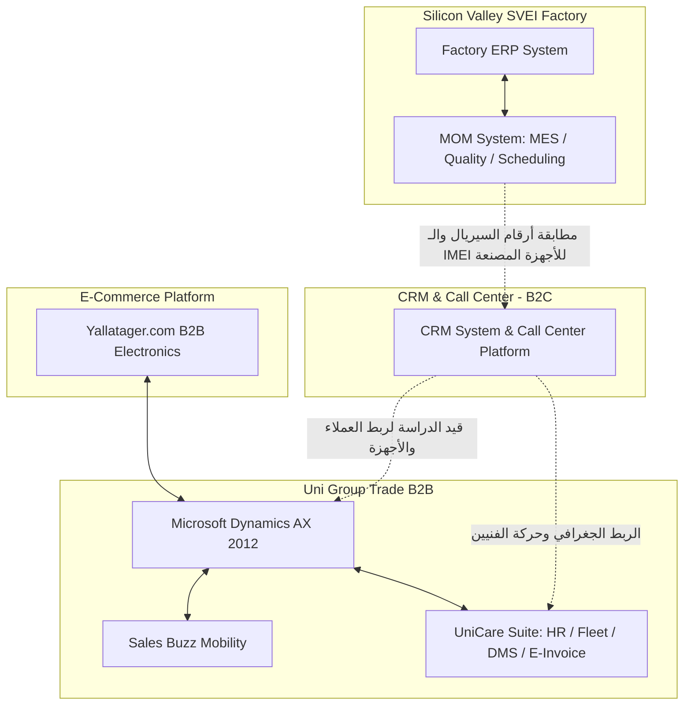

# هيكل سيستمات الشركة (Company Systems Structure)

يحتوي هذا المستند على الهيكل التفصيلي للأنظمة والبرمجيات المستخدمة في مجموعة الشركات (**Uni-Group**)، موضحاً دور كل نظام والمكونات التابعة له، بالإضافة إلى الفجوات التقنية الحالية.

---

## 1. شركة يوني جروب للتجارة - Uni Group Trade Company (B2B)

تعتمد الشركة في عملياتها التجارية بين الشركات (B2B) على مجموعة من الأنظمة المتكاملة لإدارة الحسابات، المبيعات، الخدمات، والخدمات اللوجستية:

### 1. Microsoft Dynamics AX 2012 (ERP System)
* **الوصف:** النظام الأساسي لإدارة موارد المؤسسة (ERP) من شركة مايكروسوفت.
* **الدور:** يمثل النواة الحسابية والتشغيلية للشركة؛ حيث يدير العمليات المالية، الحسابات الختامية، المشتريات، المبيعات، ومراقبة المخازن وسلاسل الإمداد.

### 2. Sales Buzz (Sales Mobility Solution)
* **الوصف:** تطبيق وحل برمجى للمبيعات الميدانية (SFA - Sales Force Automation).
* **الدور:** يُسخدم بواسطة مندوبي المبيعات في الشارع وعلى الطرق لتسجيل الطلبيات مباشرة من منافذ البيع والعملاء (B2B)، وإدارة خطوط السير، وتحصيل المستحقات، ثم مزامنة هذه البيانات تلقائياً مع نظام الـ ERP (Dynamics AX).

### 3. نظام UniCare الموحد
نظام فرعي متكامل يضم مجموعة من التطبيقات والحلول الخدمية والإدارية:
* **نظام التقارير (Reporting System):** لتجميع وتحليل البيانات واستخراج تقارير ذكاء الأعمال (BI) لدعم اتخاذ القرار.
* **إدارة أسطول السيارات (Fleet Management):** تتبع سيارات الشحن والتوزيع ومندوبي الحركة، وجدولة الصيانات الخاصة بالسيارات وتتبع استهلاك الوقود.
* **نظام الموارد البشرية (HR System):** إدارة شؤون العاملين، الحضور والانصراف، الرواتب، الإجازات، والملفات الشخصية للموظفين.
* **نظام إدارة المستندات (DMS - Document Management System):** أرشفة وتنظيم وتداول وثائق الشركة، العقود، وفواتير الموردين إلكترونياً بشكل آمن.
* **الفواتير الإلكترونية (E-Invoicing):** التكامل المباشر والربط مع منظومة الفاتورة الإلكترونية التابعة لمصلحة الضرائب المصرية لتقديم الفواتير والتقارير المالية بشكل قانوني لحظي.

### 4. قنوات غير موجودة حالياً (Not Exist)
* **نظام إدارة علاقات العملاء والكول سنتر (CRM - CallCenter) لخدمات الـ B2C:**
  * **الوضع الحالي:** لا يوجد نظام أو موقع/تطبيق موجه لعملاء التجزئة (B2C) لخدمة العملاء واستقبل المكالمات وإدارة حالات الصيانة والشكاوى.
  * **الهدف:** هذا هو النظام الجاري تصميمه وتطويره حالياً (المشروع الحالي) لسد هذه الفجوة وربطه مع باقي الأنظمة.

---

## 2. منصة يلا تاجر - Yallatager.com (B2B E-commerce Platform)

* **الوصف:** منصة تجارة إلكترونية متخصصة في قطاع الإلكترونيات موجهة للشركات والتجار (B2B E-commerce).
* **الدور:** تتيح للتجار ومحلات التجزئة تصفح المنتجات، معرفة الأسعار والكميات المتاحة، وطلب بضائع الإلكترونيات مباشرة عبر الإنترنت، مما يسهل عمليات البيع الرقمي دون الاعتماد الكلي على مندوبي المبيعات.

---

## 3. مصنع وادي السيليكون - Silicon Valley (SVEI Factory)

يعتمد المصنع في إدارته وتصنيعه على نظامين متكاملين لربط الإدارة بالمصنع وخطوط الإنتاج:

### 1. نظام إدارة موارد المؤسسة (ERP System)
* **الوصف:** نظام الـ ERP الخاص بالمصنع لإدارة الشؤون غير الفنية.
* **الدور:** يدير الشؤون المالية للمصنع، الميزانيات، المشتريات الخارجية للمواد الخام، المبيعات للوكلاء، شؤون موظفي المصنع، ومخازن المواد الخام والمنتجات النهائية.

### 2. نظام إدارة العمليات التصنيعية (MOM System - Manufacturing Operations Management)
* **الوصف:** نظام متكامل لإدارة ومراقبة العمليات التصنيعية داخل المصنع (يضم أنظمة الـ MES - Manufacturing Execution Systems).
* **الدور بالتفصيل:**
  * **تخطيط وجدولة الإنتاج (Production Scheduling):** تنظيم أوامر التشغيل وتوزيع المهام على خطوط الإنتاج والماكينات المختلفة بناءً على القدرة الاستيعابية.
  * **تتبع الإنتاج الفعلي (Production Tracking):** متابعة مراحل تحول المواد الخام إلى منتجات نهائية لحظة بلحظة على أرض المصنع.
  * **إدارة الجودة (Quality Management):** فحص المنتجات أثناء وعقب التصنيع، وتوثيق العيوب ونسب الهدر وتطبيق معايير الجودة ومطابقة المواصفات.
  * **صيانة المعدات (Maintenance Management):** إدارة وجدولة الصيانة الوقائية والدورية لماكينات المصنع لتقليل فترات التوقف المفاجئ.
  * **تكامل المخازن الفورية (WIP Inventory):** متابعة المنتجات شبه المصنعة (Work in Progress) والمواد الخام المستهلكة في كل أمر تشغيل.

---

## مخطط تكامل الأنظمة (Systems Integration Map)

يوضح المخطط التالي دور كل نظام والعلاقة بين شركات المجموعة والنظام الجاري بناؤه (CRM):

