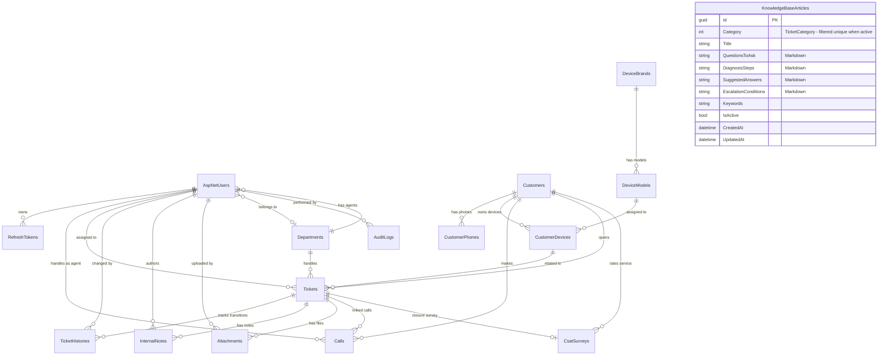

# تصميم قاعدة بيانات نظام CRM — الهيكل الفعلي المنفذ

> [!IMPORTANT]
> هذا الملف يعكس **الهيكل الفعلي المنفذ والمطبق في قاعدة البيانات** وليس التصميم الأولي.
> آخر تحديث: 14 يوليو 2026 — بعد إنجاز المراحل 1 إلى 7 كاملة.
> قاعدة البيانات: **SQL Server** | ORM: **EF Core 9** | Framework: **.NET 9**

---

## 1. استراتيجية تخزين الملفات

> [!NOTE]
> لا يتم تخزين الملفات الثنائية (صور، PDF، تسجيلات صوتية) داخل قاعدة البيانات.
> يتم رفع الملفات إلى مجلد `wwwroot/uploads` في بيئة التطوير المحلية (LocalFileStorageService)، وفي الإنتاج يُستبدل بـ AWS S3 أو Azure Blob.
> يُخزن في قاعدة البيانات **رابط الملف فقط** (`StorageUrl`).

---

## 2. مخطط العلاقات الفعلي (Entity Relationship Diagram)

> [!NOTE]
> **توضيح هام حول عدد الجداول:**
> يحتوي المخطط (ERD) أدناه على الكيانات المخصصة التي يتم التعامل معها برمجياً في طبقة الـ Domain.
> بينما تحتوي قاعدة البيانات الفعلية في SQL Server على **24 جدولاً** كالتالي:
> 1. **16 جدولاً خاصاً بالتطبيق:** (`Customers`, `CustomerPhones`, `DeviceBrands`, `DeviceModels`, `CustomerDevices`, `Calls`, `Departments`, `Tickets`, `TicketHistories`, `InternalNotes`, `Attachments`, `AuditLogs`, `CsatSurveys`, `NotificationLogs`, `ProcessedWebhookEvents`, `KnowledgeBaseArticles`).
> 2. **8 جداول خاصة بنظام الهوية والتحقق:** منها جدول `RefreshTokens` المخصص + 7 جداول افتراضية تنشأ تلقائياً بواسطة ASP.NET Identity (مثل `AspNetUsers`, `AspNetRoles`, `AspNetUserRoles`, `AspNetUserClaims` وغيرها) والتي لا يتم رسم علاقاتها الافتراضية كاملة لتسهيل قراءة المخطط.



> [!NOTE]
> جدول `KnowledgeBaseArticles` (Phase 7) **مستقل بلا مفاتيح أجنبية** — يرتبط منطقياً بالتذاكر عبر قيمة `Category` (نفس الـ `TicketCategory` enum المستخدم في `Tickets.Category`) وليس عبر FK، مما يسمح بجلب الإرشاد المناسب لحظة اختيار التصنيف أثناء المكالمة حتى قبل إنشاء التذكرة.

---

## 3. الهيكل التفصيلي الفعلي للجداول

### 🔑 Phase 1 — Identity & Auth (8 جداول ASP.NET Identity + RefreshTokens)

#### جدول `AspNetUsers` (ApplicationUser)
يرث من `IdentityUser<Guid>` — PK من نوع `uniqueidentifier` (GUID).

| الحقل | النوع في SQL | القيود | الوصف |
|---|---|---|---|
| `Id` | `uniqueidentifier` | PK | GUID تلقائي |
| `FirstName` | `nvarchar(256)` | NOT NULL | الاسم الأول |
| `LastName` | `nvarchar(256)` | NOT NULL | الاسم الأخير |
| `IsActive` | `bit` | NOT NULL, DEFAULT 1 | حالة الحساب |
| `CreatedAt` | `datetime2` | NOT NULL | تاريخ الإنشاء |
| `DepartmentId` | `uniqueidentifier` | FK → Departments, **SetNull** on delete, NULL | القسم التابع له — اختياري |
| `UserName` | `nvarchar(256)` | UNIQUE, INDEX | من Identity |
| `NormalizedUserName` | `nvarchar(256)` | UNIQUE, INDEX | من Identity |
| `Email` | `nvarchar(256)` | UNIQUE, INDEX | البريد الإلكتروني |
| `NormalizedEmail` | `nvarchar(256)` | INDEX | من Identity |
| `EmailConfirmed` | `bit` | NOT NULL | تأكيد الإيميل |
| `PasswordHash` | `nvarchar(max)` | NULL | كلمة المرور المشفرة |
| `SecurityStamp` | `nvarchar(max)` | NULL | من Identity |
| `ConcurrencyStamp` | `nvarchar(max)` | NULL | من Identity |
| `PhoneNumber` | `nvarchar(max)` | NULL | رقم الهاتف |
| `PhoneNumberConfirmed` | `bit` | NOT NULL | من Identity |
| `TwoFactorEnabled` | `bit` | NOT NULL | من Identity |
| `LockoutEnd` | `datetimeoffset` | NULL | من Identity |
| `LockoutEnabled` | `bit` | NOT NULL | من Identity |
| `AccessFailedCount` | `int` | NOT NULL | من Identity |

#### جدول `AspNetRoles` (ApplicationRole)
| الحقل | النوع | القيود | الوصف |
|---|---|---|---|
| `Id` | `uniqueidentifier` | PK | GUID تلقائي |
| `Name` | `nvarchar(256)` | UNIQUE | اسم الدور: Agent, Team Leader, Admin |
| `Description` | `nvarchar(max)` | NOT NULL | وصف الدور |
| `CreatedAt` | `datetime2` | NOT NULL | تاريخ الإنشاء |
| `NormalizedName` | `nvarchar(256)` | UNIQUE, INDEX | من Identity |
| `ConcurrencyStamp` | `nvarchar(max)` | NULL | من Identity |

#### جداول Identity الأخرى (تلقائية)
- `AspNetUserRoles` — ربط Users بـ Roles
- `AspNetUserClaims` — Claims المستخدمين
- `AspNetRoleClaims` — Claims الأدوار
- `AspNetUserLogins` — تسجيلات الدخول الخارجية
- `AspNetUserTokens` — رموز Identity المختلفة

#### جدول `RefreshTokens`
| الحقل | النوع | القيود | الوصف |
|---|---|---|---|
| `Id` | `uniqueidentifier` | PK | GUID |
| `UserId` | `uniqueidentifier` | FK → AspNetUsers, CASCADE | صاحب التوكن |
| `Token` | `nvarchar(max)` | NOT NULL | قيمة التوكن |
| `ExpiresAt` | `datetime2` | NOT NULL | تاريخ الانتهاء |
| `CreatedAt` | `datetime2` | NOT NULL | تاريخ الإنشاء |
| `CreatedByIp` | `nvarchar(max)` | NOT NULL | IP الإنشاء |
| `RevokedAt` | `datetime2` | NULL | تاريخ الإلغاء |
| `RevokedByIp` | `nvarchar(max)` | NULL | IP الإلغاء |
| `ReplacedByToken` | `nvarchar(max)` | NULL | التوكن البديل |

---

### 👥 Phase 2 — Customers & Devices (5 جداول)

#### جدول `Customers`
| الحقل | النوع | القيود | الوصف |
|---|---|---|---|
| `Id` | `uniqueidentifier` | PK | GUID |
| `Name` | `nvarchar(max)` | NOT NULL | الاسم الكامل |
| `Email` | `nvarchar(max)` | NULL | البريد الإلكتروني |
| `Province` | `nvarchar(max)` | NULL | المحافظة |
| `City` | `nvarchar(max)` | NULL | المدينة |
| `AddressDetails` | `nvarchar(max)` | NULL | العنوان التفصيلي |
| `CreatedAt` | `datetime2` | NOT NULL | تاريخ التسجيل |
| `PreferredChannels` | `nvarchar(max)` | NOT NULL, DEFAULT `N'[]'` | **EF Core 9 Primitive Collection** — JSON array مثل `["WhatsApp","Email"]` |

> [!TIP]
> حقل `PreferredChannels` هو ميزة EF Core 9 — يُخزن `List<string>` كعمود JSON واحد دون جدول وسيط.

#### جدول `CustomerPhones`
| الحقل | النوع | القيود | الوصف |
|---|---|---|---|
| `Id` | `uniqueidentifier` | PK | GUID |
| `CustomerId` | `uniqueidentifier` | FK → Customers, CASCADE | العميل المالك |
| `Phone` | `nvarchar(max)` | NOT NULL, **UNIQUE INDEX** | رقم الهاتف — مفهرس للـ Caller ID |
| `IsPrimary` | `bit` | NOT NULL | هل هو الرقم الرئيسي؟ |

> [!NOTE]
> الهواتف في جدول منفصل (One-to-Many) لدعم عملاء بأرقام متعددة. البحث بالهاتف يتم عبر هذا الجدول المفهرس.

#### جدول `DeviceBrands`
| الحقل | النوع | القيود | الوصف |
|---|---|---|---|
| `Id` | `uniqueidentifier` | PK | GUID |
| `Name` | `nvarchar(max)` | NOT NULL, **UNIQUE INDEX** | اسم الماركة (Samsung, Apple...) |

#### جدول `DeviceModels`
| الحقل | النوع | القيود | الوصف |
|---|---|---|---|
| `Id` | `uniqueidentifier` | PK | GUID |
| `BrandId` | `uniqueidentifier` | FK → DeviceBrands, CASCADE | الماركة |
| `Name` | `nvarchar(max)` | NOT NULL | اسم الموديل (Galaxy S24...) |

**Composite Unique Index:** `(BrandId, Name)` — لا يمكن تكرار موديل تحت نفس الماركة.

#### جدول `CustomerDevices`
| الحقل | النوع | القيود | الوصف |
|---|---|---|---|
| `Id` | `uniqueidentifier` | PK | GUID |
| `CustomerId` | `uniqueidentifier` | FK → Customers, CASCADE | مالك الجهاز |
| `ModelId` | `uniqueidentifier` | FK → DeviceModels, CASCADE | موديل الجهاز |
| `IMEI` | `nvarchar(max)` | NULL, **Filtered Unique Index** | IMEI — فريد إن وُجد |
| `SerialNumber` | `nvarchar(max)` | NULL, **Filtered Unique Index** | Serial — فريد إن وُجد |
| `PurchaseDate` | `datetime2` | NOT NULL | تاريخ الشراء |
| `InvoiceNumber` | `nvarchar(max)` | NULL | رقم الفاتورة |
| `WarrantyExpiry` | `datetime2` | NOT NULL | تاريخ انتهاء الضمان — يُحسب تلقائياً +2 سنة |

**Filtered Unique Indexes:**
```sql
-- يمنع تكرار IMEI لكنه يسمح بـ NULL
CREATE UNIQUE INDEX ON CustomerDevices (IMEI) WHERE [IMEI] IS NOT NULL AND [IMEI] != ''
CREATE UNIQUE INDEX ON CustomerDevices (SerialNumber) WHERE [SerialNumber] IS NOT NULL AND [SerialNumber] != ''
```

---

### 📞 Phase 3 — Call Center (1 جدول)

#### جدول `Calls`
| الحقل | النوع | القيود | الوصف |
|---|---|---|---|
| `Id` | `uniqueidentifier` | PK | GUID |
| `CustomerId` | `uniqueidentifier` | FK → Customers, **SetNull** on delete, NULL | العميل — قابل للـ NULL للأرقام غير المسجلة |
| `AgentId` | `uniqueidentifier` | FK → AspNetUsers, **Restrict** on delete | الموظف المستقبل/المتصل |
| `TicketId` | `nvarchar(20)` | FK → Tickets, **SetNull** on delete, NULL | التذكرة المرتبطة — اختياري |
| `Direction` | `int` | NOT NULL | `0=Inbound` / `1=Outbound` (enum) |
| `PhoneNumber` | `nvarchar(max)` | NOT NULL | الرقم المتصل أو المتصل به |
| `DurationSeconds` | `int` | NOT NULL | مدة المكالمة بالثواني |
| `Summary` | `nvarchar(max)` | NULL | ملاحظات الموظف بعد المكالمة |
| `RecordingUrl` | `nvarchar(max)` | NULL | رابط التسجيل الصوتي |
| `CreatedAt` | `datetime2` | NOT NULL | وقت المكالمة |

**Indexes للأداء:** `PhoneNumber`, `CustomerId`, `AgentId`, `TicketId`

---

### 🎫 Phase 4 — Tickets, SLA & Departments (5 جداول)

#### جدول `Departments`
| الحقل | النوع | القيود | الوصف |
|---|---|---|---|
| `Id` | `uniqueidentifier` | PK | GUID |
| `Name` | `nvarchar(max)` | NOT NULL, **UNIQUE INDEX** | اسم القسم |
| `Description` | `nvarchar(max)` | NULL | وصف القسم |
| `IsActive` | `bit` | NOT NULL, DEFAULT 1 | هل القسم نشط؟ |
| `CreatedAt` | `datetime2` | NOT NULL | تاريخ الإنشاء |

#### جدول `Tickets`
| الحقل | النوع | القيود | الوصف |
|---|---|---|---|
| `Id` | `nvarchar(450)` | PK | رقم مقروء: `T-2026-00001` |
| `CustomerId` | `uniqueidentifier` | FK → Customers, **Restrict** | العميل صاحب التذكرة |
| `CustomerDeviceId` | `uniqueidentifier` | FK → CustomerDevices, **SetNull**, NULL | الجهاز المعني |
| `AssignedToId` | `uniqueidentifier` | FK → AspNetUsers, **Restrict**, NULL | الموظف المسؤول |
| `DepartmentId` | `uniqueidentifier` | FK → Departments, **Restrict**, NULL | القسم المسؤول |
| `Title` | `nvarchar(max)` | NOT NULL | عنوان المشكلة |
| `Description` | `nvarchar(max)` | NOT NULL | تفاصيل المشكلة |
| `Category` | `int` | NOT NULL | تصنيف التذكرة (enum — 11 تصنيف) |
| `Status` | `int` | NOT NULL, **INDEX** | حالة التذكرة (enum — 9 حالات) |
| `Priority` | `int` | NOT NULL, **INDEX** | الأولوية (Low=0, Medium=1, High=2, Critical=3) |
| `SlaDeadline` | `datetime2` | NULL, **INDEX** | الموعد النهائي للحل |
| `SlaBreached` | `bit` | NOT NULL | هل تجاوز الـ SLA؟ |
| `SlaPausedAt` | `datetime2` | NULL | وقت إيقاف عداد SLA (عند WaitingForCustomer/Parts) |
| `TotalPausedSeconds` | `bigint` | NOT NULL, DEFAULT 0 | إجمالي وقت الإيقاف بالثواني |
| `ResolutionNote` | `nvarchar(max)` | NULL | ملاحظة الحل عند الإغلاق |
| `ChatwootConversationId` | `nvarchar(max)` | NULL | معرف محادثة Chatwoot (للمرحلة 6) |
| `CreatedAt` | `datetime2` | NOT NULL, **INDEX** | وقت الإنشاء |
| `UpdatedAt` | `datetime2` | NOT NULL | آخر تحديث |
| `ClosedAt` | `datetime2` | NULL | وقت الإغلاق النهائي |

**تصنيفات التذكرة (TicketCategory enum):**
`ScreenDamage=0, BatteryIssue=1, ChargingPort=2, SoftwareIssue=3, NetworkConnectivity=4, CameraIssue=5, SpeakerMicrophone=6, PhysicalDamage=7, WarrantyInquiry=8, GeneralInquiry=9, Other=99`

**حالات التذكرة (TicketStatus enum):**
`New=0, Open=1, InProgress=2, WaitingForCustomer=3, WaitingForParts=4, Escalated=5, Resolved=6, Closed=7, Cancelled=8`

#### جدول `TicketHistories`
| الحقل | النوع | القيود | الوصف |
|---|---|---|---|
| `Id` | `uniqueidentifier` | PK | GUID |
| `TicketId` | `nvarchar(450)` | FK → Tickets, **Cascade** | التذكرة |
| `ChangedById` | `uniqueidentifier` | FK → AspNetUsers, **Restrict** | الموظف الذي أجرى التغيير |
| `FromStatus` | `int` | NULL | الحالة السابقة (NULL عند الإنشاء) |
| `ToStatus` | `int` | NOT NULL | الحالة الجديدة |
| `Note` | `nvarchar(max)` | NULL | ملاحظة سبب التغيير |
| `TimeInStatus` | `bigint` | NULL | الوقت المُمضى في الحالة السابقة (ثواني) — لحساب SLA |
| `CreatedAt` | `datetime2` | NOT NULL | وقت التسجيل |

#### جدول `InternalNotes`
| الحقل | النوع | القيود | الوصف |
|---|---|---|---|
| `Id` | `uniqueidentifier` | PK | GUID |
| `TicketId` | `nvarchar(450)` | FK → Tickets, **Cascade** | التذكرة |
| `AuthorId` | `uniqueidentifier` | FK → AspNetUsers, **Restrict** | الكاتب |
| `Content` | `nvarchar(max)` | NOT NULL | نص الملاحظة |
| `IsEdited` | `bit` | NOT NULL | هل تم تعديلها؟ |
| `CreatedAt` | `datetime2` | NOT NULL | وقت الكتابة |
| `UpdatedAt` | `datetime2` | NULL | وقت آخر تعديل |

#### جدول `Attachments`
| الحقل | النوع | القيود | الوصف |
|---|---|---|---|
| `Id` | `uniqueidentifier` | PK | GUID |
| `TicketId` | `nvarchar(450)` | FK → Tickets, **Cascade** | التذكرة |
| `UploadedById` | `uniqueidentifier` | FK → AspNetUsers, **Restrict** | من رفع الملف |
| `FileName` | `nvarchar(max)` | NOT NULL | اسم الملف الأصلي |
| `StorageUrl` | `nvarchar(max)` | NOT NULL | مسار الملف المحلي أو رابط الـ Cloud |
| `FileSizeBytes` | `bigint` | NOT NULL | حجم الملف بالبايت |
| `ContentType` | `nvarchar(max)` | NOT NULL | MIME type (image/jpeg, application/pdf...) |
| `CreatedAt` | `datetime2` | NOT NULL | وقت الرفع |

---

## 4. الـ Migrations المطبقة (EF Core 9)

| # | Migration | التاريخ | ما تفعله |
|:-:|---|---|---|
| 1 | `20260701080141_InitialCreate` | 2026-07-01 | Identity tables + RefreshTokens |
| 2 | `20260701085518_AddPhase2Entities` | 2026-07-01 | Customers + CustomerPhones + DeviceBrands + DeviceModels + CustomerDevices |
| 3 | `20260701092950_AddPhase3Calls` | 2026-07-01 | Calls + Performance Indexes |
| 4 | `20260701093604_AddUniqueIndexesForBrandAndModel` | 2026-07-01 | Unique Index على Brand.Name + Composite Unique على (BrandId, Name) |
| 5 | `20260702102445_AddPhase4TicketsWorkflowsAndSla` | 2026-07-02 | Departments + Tickets + TicketHistories + InternalNotes + Attachments |
| 6 | `20260705110501_AddCustomerPreferredChannels` | 2026-07-05 | حقل PreferredChannels كـ JSON Column (EF Core 9 Primitive Collection) |
| 7 | `20260705115426_AddCallTicketLinkAndUserDepartment` | 2026-07-05 | TicketId FK في Calls + DepartmentId FK في Users |
| 8 | `20260714085023_AddPhase6Entities` | 2026-07-14 | AuditLogs + CsatSurveys + NotificationLogs + ProcessedWebhookEvents |
| 9 | `20260714105921_AddPhase7KnowledgeBase` | 2026-07-14 | KnowledgeBaseArticles + فهرس فريد مُفلتر على Category + فهرس CreatedAt |

---

## 5. الفهارس والقيود الكاملة (All Constraints & Indexes)

```sql
-- CustomerPhones
CREATE UNIQUE INDEX IX_CustomerPhones_Phone ON CustomerPhones (Phone);

-- DeviceBrands
CREATE UNIQUE INDEX IX_DeviceBrands_Name ON DeviceBrands (Name);

-- DeviceModels
CREATE UNIQUE INDEX IX_DeviceModels_BrandId_Name ON DeviceModels (BrandId, Name);

-- CustomerDevices (Filtered - allows NULL)
CREATE UNIQUE INDEX IX_CustomerDevices_IMEI ON CustomerDevices (IMEI)
    WHERE [IMEI] IS NOT NULL AND [IMEI] != '';
CREATE UNIQUE INDEX IX_CustomerDevices_SerialNumber ON CustomerDevices (SerialNumber)
    WHERE [SerialNumber] IS NOT NULL AND [SerialNumber] != '';

-- Departments
CREATE UNIQUE INDEX IX_Departments_Name ON Departments (Name);

-- Calls (Performance)
CREATE INDEX IX_Calls_PhoneNumber ON Calls (PhoneNumber);
CREATE INDEX IX_Calls_CustomerId ON Calls (CustomerId);
CREATE INDEX IX_Calls_AgentId ON Calls (AgentId);

-- Tickets (Performance)
CREATE INDEX IX_Tickets_Status ON Tickets (Status);
CREATE INDEX IX_Tickets_Priority ON Tickets (Priority);
CREATE INDEX IX_Tickets_SlaDeadline ON Tickets (SlaDeadline);
CREATE INDEX IX_Tickets_CreatedAt ON Tickets (CreatedAt);
CREATE INDEX IX_Tickets_AssignedToId ON Tickets (AssignedToId);
CREATE INDEX IX_Tickets_CustomerId ON Tickets (CustomerId);

-- KnowledgeBaseArticles (Phase 7)
-- فهرس فريد مُفلتر: مقال إرشادي نشط واحد فقط لكل تصنيف
CREATE UNIQUE INDEX IX_KnowledgeBaseArticles_Category_Active
    ON KnowledgeBaseArticles (Category) WHERE [IsActive] = 1;
CREATE INDEX IX_KnowledgeBaseArticles_CreatedAt ON KnowledgeBaseArticles (CreatedAt);
```

---

## 6. سلوك الحذف (Delete Behaviors)

| العلاقة | السلوك | السبب |
|---|:-:|---|
| RefreshToken → User | **Cascade** | حذف المستخدم يحذف توكناته |
| CustomerPhone → Customer | **Cascade** | الهواتف لا معنى لها بدون عميل |
| CustomerDevice → Customer | **Cascade** | الأجهزة تتبع العميل |
| CustomerDevice → DeviceModel | **Cascade** | تبعية الموديل |
| Call → Customer | **SetNull** | المكالمات تُحفظ حتى بعد حذف العميل |
| Call → Agent (User) | **Restrict** | لا يمكن حذف موظف له مكالمات مسجلة |
| Ticket → Customer | **Restrict** | لا يمكن حذف عميل له تذاكر |
| Ticket → Department | **Restrict** | لا يمكن حذف قسم له تذاكر |
| Ticket → Agent (AssignedTo) | **Restrict** | لا يمكن حذف موظف له تذاكر |
| Ticket → CustomerDevice | **SetNull** | التذكرة تبقى حتى لو حُذف الجهاز |
| TicketHistory → Ticket | **Cascade** | السجل التاريخي يتبع التذكرة |
| InternalNote → Ticket | **Cascade** | الملاحظات تتبع التذكرة |
| Attachment → Ticket | **Cascade** | المرفقات تتبع التذكرة |

---

## 7. كيف يدعم التصميم متطلبات المشروع

### Caller ID — التعرف الفوري على المتصل
```
PhoneNumber يأتي من الهاتف
→ بحث في CustomerPhones.Phone (UNIQUE INDEX) ← فوري جداً
→ Compiled Query (EF Core 9) يجلب العميل + أجهزته + تذاكره المفتوحة
```

### SLA — حساب وقت الخدمة بدقة
```
Ticket.SlaDeadline    → الموعد النهائي
Ticket.SlaPausedAt    → وقت بدء الإيقاف (WaitingForCustomer/Parts)
Ticket.TotalPausedSeconds → إجمالي وقت الإيقاف المتراكم
TicketHistory.TimeInStatus → الوقت الفعلي في كل حالة للتحليل
```

### State Machine — دورة حياة التذكرة
```
الانتقالات المسموحة (محرك صارم في TransitionTicketStatusCommand):
New → Open → InProgress → WaitingForCustomer ↔ InProgress
InProgress → WaitingForParts ↔ InProgress
InProgress → Escalated → Resolved → Closed
أي حالة → Cancelled
```

### PreferredChannels — قنوات التواصل المفضلة (EF Core 9)
```csharp
// مثال القيمة المخزنة كـ JSON في عمود واحد:
["WhatsApp", "Email"]
// يُستخدم في المرحلة 6 لتحديد قناة إرسال الإشعارات
```

---

## 8. جداول المرحلة 6 — منفذة ✅ (Migration: `20260714085023_AddPhase6Entities`)

الجداول الأربعة التالية أُضيفت وطُبقت لتغطية متطلبات التدقيق ورضا العملاء والإشعارات وضمان عدم تكرار معالجة الـ Webhooks:

#### جدول `AuditLogs`
يسجل كل عمليات الكتابة والتعديل والحذف تلقائياً. يستخدم ميزة الـ **Complex Type** لـ EF Core 9 لدمج حقول العميل تحت فئة `ClientInfo`.

| الحقل | النوع في SQL | القيود | الوصف |
|---|---|---|---|
| `Id` | `uniqueidentifier` | PK | GUID |
| `UserId` | `uniqueidentifier` | FK → AspNetUsers, SetNull, NULL | المستخدم المسؤول |
| `Action` | `nvarchar(100)` | NOT NULL | نوع العملية (Added, Modified, Deleted) |
| `TableName` | `nvarchar(100)` | NOT NULL | اسم الجدول المتأثر |
| `RecordId` | `nvarchar(100)` | NOT NULL | المعرف الفريد للسجل المعدل |
| `BeforeValue` | `nvarchar(max)` | NULL | JSON بالقيم الأصلية قبل التعديل |
| `AfterValue` | `nvarchar(max)` | NULL | JSON بالقيم الجديدة بعد التعديل |
| `ClientInfo_IpAddress` | `nvarchar(100)` | NULL | عنوان IP الخاص بالقائم بالعملية (Complex Type) |
| `ClientInfo_UserAgent` | `nvarchar(max)` | NULL | نوع المتصفح وبيئة عمل المستخدم (Complex Type) |
| `CreatedAt` | `datetime2` | NOT NULL, **INDEX** | وقت العملية بالـ UTC |

> [!TIP]
> **ملاحظة الأداء وتفادي تضخم البيانات (Data Bloat):**
> سيتم تفعيل خدمة خلفية باسم `AuditLogArchiverService` تقوم يومياً بحذف أو أرشفة السجلات التي مر عليها أكثر من 6 أشهر (قابلة للتعديل عبر الإعداد `AuditLogRetentionMonths`) لتأمين ثبات وسرعة الاستعلامات بقاعدة البيانات.

#### جدول `CsatSurveys`
يخزن تقييمات العملاء للخدمة.

| الحقل | النوع في SQL | القيود | الوصف |
|---|---|---|---|
| `Id` | `uniqueidentifier` | PK | GUID |
| `TicketId` | `nvarchar(450)` | FK → Tickets, CASCADE, **UNIQUE INDEX** | التذكرة المرتبطة بالاستبيان |
| `CustomerId` | `uniqueidentifier` | FK → Customers, CASCADE | العميل المقيم |
| `Rating` | `int` | NOT NULL | التقييم (من 1 إلى 5 نجوم) |
| `Feedback` | `nvarchar(1000)` | NULL | ملاحظات نصية إضافية |
| `SurveyToken` | `nvarchar(450)` | NOT NULL, **UNIQUE INDEX** | توكن وصول آمن مشفر فريد (Guid) لمنع التلاعب |
| `SentAt` | `datetime2` | NOT NULL | وقت إرسال رابط التقييم |
| `ExpiresAt` | `datetime2` | NOT NULL | تاريخ انتهاء صلاحية التوكن (SentAt + 7 أيام) |
| `SubmittedAt` | `datetime2` | NULL | وقت تقديم العميل للتقييم فعلياً |

* **فهرس فريد على التذكرة:** `CREATE UNIQUE INDEX IX_CsatSurveys_TicketId ON CsatSurveys (TicketId);` — يضمن إرسال استبيان واحد فقط لكل تذكرة.
* **فهرس فريد للتوكن:** `CREATE UNIQUE INDEX IX_CsatSurveys_SurveyToken ON CsatSurveys (SurveyToken);` — لسرعة البحث بالتوكن عند تعبئة الاستبيان.

#### جدول `NotificationLogs`
يتتبع الإشعارات المرسلة لضمان الجودة ومتابعة التوصيل.

| الحقل | النوع في SQL | القيود | الوصف |
|---|---|---|---|
| `Id` | `uniqueidentifier` | PK | GUID |
| `RecipientType` | `nvarchar(100)` | NOT NULL | نوع المستلم (Agent, Customer) |
| `RecipientId` | `nvarchar(100)` | NOT NULL | معرف المستلم (UserId أو الهاتف أو الإيميل) |
| `Channel` | `nvarchar(100)` | NOT NULL | القناة (Email, WhatsApp, InApp) |
| `TemplateType` | `nvarchar(100)` | NOT NULL | نوع القالب (TicketCreated, CsatSurvey...) |
| `Status` | `nvarchar(100)` | NOT NULL | حالة الإرسال (Sent, Failed) |
| `MessageContent` | `nvarchar(max)` | NULL | نص الرسالة النهائي |
| `ErrorMessage` | `nvarchar(max)` | NULL | تفاصيل خطأ الإرسال في حال الفشل |
| `SentAt` | `datetime2` | NOT NULL, **INDEX** | وقت الإرسال |

#### جدول `ProcessedWebhookEvents`
جدول Idempotency لمنع المعالجة المكررة لأحداث Chatwoot (يُدرج في نفس معاملة الحفظ الخاصة بالبيانات).

| الحقل | النوع في SQL | القيود | الوصف |
|---|---|---|---|
| `EventId` | `nvarchar(450)` | **PK** | المعرف الفريد للحدث الوارد من Chatwoot |
| `ProcessedAt` | `datetime2` | NOT NULL | وقت معالجة الحدث |

---

## 9. سلوكيات الحذف المضافة في المرحلة 6

| العلاقة | السلوك | السبب |
|---|:-:|---|
| AuditLog → User | **SetNull** | الاحتفاظ بسجلات التدقيق حتى بعد إزالة الموظف |
| CsatSurvey → Ticket | **Cascade** | حذف التذكرة يحذف الاستبيان التابع لها تلقائياً |
| CsatSurvey → Customer | **Cascade** | حذف العميل يحذف تقييماته التابعة له |

---

## 10. جدول المرحلة 7 — منفذ ✅ (Migration: `20260714105921_AddPhase7KnowledgeBase`)

#### جدول `KnowledgeBaseArticles`
مقالات قاعدة المعرفة وإرشاد المكالمات (Call Flow Guidance) — تُعرض للموظف أثناء المكالمة حسب تصنيف التذكرة المختار. حقول المحتوى تُخزَّن **Markdown** خاماً وتُعرض بمكوّن Markdown في الواجهة.

| الحقل | النوع في SQL | القيود | الوصف |
|---|---|---|---|
| `Id` | `uniqueidentifier` | **PK** | معرف المقال |
| `Category` | `int` | NOT NULL, **Filtered Unique Index** | تصنيف التذكرة (`TicketCategory` enum) — مقال نشط واحد فقط لكل تصنيف |
| `Title` | `nvarchar(200)` | NOT NULL | عنوان المقال |
| `QuestionsToAsk` | `nvarchar(max)` | NOT NULL | أسئلة الاستقبال — Markdown |
| `DiagnosisSteps` | `nvarchar(max)` | NOT NULL | خطوات التشخيص المرتبة — Markdown |
| `SuggestedAnswers` | `nvarchar(max)` | NOT NULL | إجابات جاهزة للعميل — Markdown |
| `EscalationConditions` | `nvarchar(max)` | NOT NULL | شروط التصعيد والقسم المستهدف — Markdown |
| `Keywords` | `nvarchar(500)` | NOT NULL, DEFAULT `''` | كلمات مفتاحية/مرادفات لتعزيز البحث النصي |
| `IsActive` | `bit` | NOT NULL | هل المقال يُقدَّم للموظفين أثناء المكالمات |
| `CreatedAt` | `datetime2` | NOT NULL, **INDEX** | تاريخ الإنشاء (UTC) |
| `UpdatedAt` | `datetime2` | NULL | تاريخ آخر تعديل (UTC) |

**الفهارس:**

| الفهرس | النوع | الأعمدة | الشرط | الغرض |
|---|---|---|---|---|
| `IX_KnowledgeBaseArticles_Category_Active` | UNIQUE (Filtered) | `Category` | `[IsActive] = 1` | ضمان مقال إرشادي نشط واحد فقط لكل تصنيف مع السماح بأي عدد من المسودات/الأرشيف |
| `IX_KnowledgeBaseArticles_CreatedAt` | Non-Unique | `CreatedAt` | — | تسريع القوائم الإدارية المرتبة بالأحدث |

**العلاقات:** الجدول مستقل بلا مفاتيح أجنبية — الربط المنطقي بالتذاكر عبر قيمة `Category` المشتركة مع `Tickets.Category`، مما يتيح جلب الإرشاد فور اختيار التصنيف أثناء المكالمة (قبل إنشاء التذكرة).

**نمط الوصول (Hot Path):** استعلام `Category + IsActive` يُنفَّذ مع كل مكالمة واردة، لذا يُخدَم عبر **EF Core 9 Compiled Query** (`EF.CompileAsyncQuery` + `AsNoTracking`) في `KnowledgeBaseReadService` — ترجمة شجرة التعبير مرة واحدة لكل عملية مع الاستفادة المباشرة من الفهرس الفريد المُفلتر.
