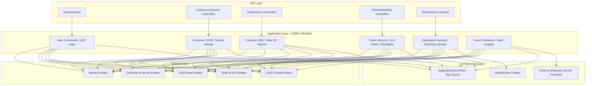
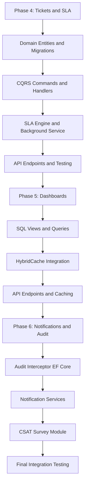

# مخطط تصميم موديولات النظام (Modules Design Blueprint)

**آخر تحديث:** 5 يوليو 2026 | **الحالة:** Phase 1 ✅ | Phase 2 ✅ | Phase 3 ✅ | Phase 4 ✅ | Phase 5 ✅ | Phase 6 ⏳
**إجمالي الاختبارات:** 49/49 ناجح (16 Phase2 + 10 Phase3 + 15 Phase4 + 8 Phase5)
**التقنيات:** .NET 9 + EF Core 9 + CQRS/MediatR + HybridCache + SQL Server

يحتوي هذا المستند على التصميم التفصيلي لكل موديول (Module) من الموديولات الستة لنظام الـ CRM، موضحاً دور كل موديول، ما يحتويه في كل طبقة من طبقات الـ Clean Architecture (Domain, Application, Infrastructure, API)، وكيفية ترابطه مع قاعدة البيانات.

---

## المخطط العام لتكامل الموديولات (Modules Architecture Map)



---

## 1. الموديول الأول: الهوية والصلاحيات (Identity & Permissions Module) - [مكتمل ✅ — مختبر ✅]
مسؤول عن إدارة الموظفين، الحسابات، صلاحيات الدخول، وتأمين نقاط النهاية (Endpoints).

### أ. طبقة الـ Domain:
* **`ApplicationUser`:** يرث من `IdentityUser<Guid>` ويحتوي على: `FirstName`, `LastName`, `CreatedAt`, `IsActive`.
* **`ApplicationRole`:** يرث من `IdentityRole<Guid>` ويحتوي على: `Description`, `CreatedAt`.
* **`RefreshToken`:** لحفظ جلسات الموظفين وتحديثها بأمان.

### ب. طبقة الـ Application:
* **الـ Interfaces:** `IJwtProvider` لتوليد رموز الـ Access Token والـ Refresh Token.
* **الـ Commands:** 
  * `RegisterCommand`: لإنشاء حساب موظف جديد.
  * `LoginCommand`: لتسجيل الدخول والتحقق من حساب الموظف وتوليد التوكن.
  * `RefreshTokenCommand`: لتجديد التوكن التالف بدون إعادة إدخال كلمة المرور.

### ج. طبقة الـ Infrastructure:
* **`ApplicationDbContext`:** يحتوي على إعدادات جداول الهوية وربطها بالـ SQL Server.
* **`JwtProvider`:** تطبيق خدمة توليد التوكنز والتحقق من صلاحيتها.

### د. طبقة الـ API:
* **`AuthController`:** يحتوي على Endpoints مثل: `api/auth/register`, `api/auth/login`.
* **الـ Middleware:** إعداد الـ Authentication والـ Authorization.

---

## 2. الموديول الثاني: العملاء والأجهزة والضمان (Customers, Devices & Warranty) - [مكتمل ✅ — مختبر ✅ 16/16 اختبار]
مسؤول عن إنشاء وإدارة ملفات العملاء، أرقام هواتفهم، أجهزتهم المملوكة، وحالة ضمان كل جهاز.

### أ. طبقة الـ Domain:
* **`Customer`:** يمثل العميل الأساسي (`Id`, `Name`, `Email`, `Province`, `City`, `AddressDetails`, `PreferredChannels` [List<string> - Primitive Collection], `CreatedAt`).
* **`CustomerPhone`:** أرقام الهواتف المتعددة للعميل (`Id`, `CustomerId`, `Phone`, `IsPrimary`).
* **`DeviceBrand`:** الماركات (مثل Samsung, Apple).
* **`DeviceModel`:** الموديلات (مثل Galaxy S24, iPhone 15) وترتبط بالماركة.
* **`CustomerDevice`:** الأجهزة المملوكة للعملاء مع بيانات الشراء والضمان (`Id`, `CustomerId`, `ModelId`, `IMEI`, `SerialNumber`, `PurchaseDate`, `InvoiceNumber`, `WarrantyExpiry`).

### ب. طبقة الـ Application:
* **الـ Commands:**
  * `CreateCustomerCommand`: إنشاء عميل جديد مع هاتفه وعنوانه الأساسي.
  * `AddCustomerDeviceCommand`: ربط جهاز جديد بالعميل وتحديد الضمان وفواتير الشراء.
  * `UpdateCustomerCommand`: تعديل بيانات العميل أو إضافة هواتف أخرى.
* **الـ Queries:**
  * `GetCustomerDetailsQuery`: جلب بيانات العميل وتاريخ أجهزته (محسن كـ **EF Core 9 Compiled Query**).

### ج. طبقة الـ Infrastructure:
* **الـ DB Mapping:** Fluent API لإعداد العلاقات:
  * علاقة One-to-Many بين العميل وأرقام هواتفه وأجهزته.
  * وضع قيد فريد (Unique Constraints) على حقل `Phone` وحقلي `IMEI` و `SerialNumber` لمنع التكرار.
  * رسم خرائط `PreferredChannels` كمجموعة أولية (Primitive Collection) تُخزن كصيغة JSON array في عمود `nvarchar(max)` بشكل تلقائي في EF Core 9.

### د. طبقة الـ API:
* **`CustomersController`:** Endpoints لإضافة وتحديث وجلب بيانات العملاء.
* **`DevicesController`:** Endpoints لإدارة الماركات، الموديلات، وربط الأجهزة بالعملاء.

---

## 3. الموديول الثالث: الكول سنتر والبحث المتقدم (Call Center & Search) - [مكتمل ✅ — مختبر ✅ 10/10 اختبار]
مسؤول عن تسجيل المكالمات، التعرف على المتصل (Caller ID)، شاشة العميل الموحدة 360° View، والبحث المفهرس والسريع.

### أ. طبقة الـ Domain:
* **`Call`:** يمثل مكالمة واردة أو صادرة (`Id`, `CustomerId`, `AgentId`, `Direction` [Inbound/Outbound], `Duration` [بالثواني], `Summary`, `RecordingUrl` [رابط ملف الصوت على S3], `CreatedAt`).

### ب. طبقة الـ Application:
* **الـ Commands:**
  * `LogCallCommand`: لتسجيل المكالمة وملخصها ورابط التسجيل الصوتي فور انتهائها.
* **الـ Queries:**
  * `GetCallerProfileQuery`: يستعلم بالهاتف عن العميل فور رنين الاتصال (محسن كـ **EF Core 9 Compiled Query**). لو وجد العميل، يجلب بيانات الـ 360° View (البيانات، الأجهزة، التذاكر المفتوحة)، ولو لم يجد، يعيد إشارة لفتح نموذج عميل جديد.
  * `SearchSystemQuery`: للبحث السريع والمفهرس بالاسم، الهاتف، IMEI، السيريال، أو رقم التذكرة.

### ج. طبقة الـ Infrastructure:
* **البحث والـ Indexing:** إعداد Indexes في الـ SQL Server على الأعمدة الأكثر بحثاً (`Phone`, `IMEI`, `SerialNumber`).
* **تخزين الصوت:** واجهة (Interface) لرفع الملفات الصوتية على خادم تخزين خارجي (AWS S3 / Azure Blobs) وحفظ الرابط فقط.

### د. طبقة الـ API:
* **`CallsController`:** Endpoints لتسجيل المكالمات وجلب سجل الاتصالات.
* **`SearchController`:** Endpoint موحد للبحث الذكي المتقدم.

---

## 4. الموديول الرابع: الحالات والتذاكر ومسار العمل (Tickets, Workflows & SLA) - [مكتمل ✅ — مختبر ✅]

**الوصف:** قلب النظام وأصعب مرحلة. مسؤول عن إدارة دورة حياة التذكرة من لحظة الفتح حتى الإغلاق، التوجيه التلقائي بين الأقسام، منطق الـ SLA، التصعيد الزمني، وسجل كل حركة بدقة ثانية.

---

### أ. طبقة الـ Domain (الكيانات والقواعد)

#### 1. `Ticket` — التذكرة الرئيسية
```
Id               : string        — رقم التذكرة بصيغة مقروءة "T-2026-00001" (ليس Guid)
CustomerId       : Guid          — FK إلى Customers (مطلوب)
CustomerDeviceId : Guid?         — FK إلى CustomerDevices (اختياري — قد تكون استفساراً بدون جهاز)
Title            : string        — عنوان موجز للمشكلة (MaxLength: 200)
Description      : string        — الوصف التفصيلي (MaxLength: 4000)
Category         : TicketCategory Enum — تصنيف المشكلة (انظر Enum أدناه)
Status           : TicketStatus Enum   — الحالة الحالية (انظر State Machine أدناه)
Priority         : TicketPriority Enum — الأولوية (Low, Medium, High, Critical)
AssignedToId     : Guid?         — FK إلى Users (الموظف المسند إليه التذكرة)
DepartmentId     : Guid?         — FK إلى Departments (القسم المسؤول)
SlaDeadline      : DateTime?     — الموعد النهائي المحسوب تلقائياً بناءً على الأولوية
SlaBreached      : bool          — هل تم تجاوز الـ SLA؟ (يُحسب ويُخزن)
SlaPausedAt      : DateTime?     — وقت إيقاف عداد الـ SLA (عند Waiting_For_Customer)
TotalPausedSeconds : long        — إجمالي وقت الإيقاف المتراكم (لحساب SLA الحقيقي)
ResolutionNote   : string?       — ملاحظة الحل عند الإغلاق (MaxLength: 2000)
ChatwootConversationId : string? — معرف المحادثة في Chatwoot (لربط التذاكر بالدردشات اختيارياً) (MaxLength: 100)
CreatedAt        : DateTime      — UTC
UpdatedAt        : DateTime      — UTC (يُحدَّث تلقائياً في كل تغيير)
ClosedAt         : DateTime?     — وقت الإغلاق الفعلي
```

#### 2. `TicketCategory` — Enum تصنيف المشكلة
```csharp
public enum TicketCategory
{
    ScreenDamage        = 0,   // عطل شاشة
    BatteryIssue        = 1,   // مشكلة بطارية
    ChargingPort        = 2,   // مشكلة شحن
    SoftwareIssue       = 3,   // مشكلة برمجية
    NetworkConnectivity = 4,   // مشكلة اتصال
    CameraIssue         = 5,   // مشكلة كاميرا
    SpeakerMicrophone   = 6,   // مشكلة صوت
    PhysicalDamage      = 7,   // تلف جسدي
    WarrantyInquiry     = 8,   // استفسار ضمان
    GeneralInquiry      = 9,   // استفسار عام
    Other               = 99   // أخرى
}
```

#### 3. `TicketStatus` — Enum الحالة (State Machine)
```csharp
public enum TicketStatus
{
    New                 = 0,   // جديدة — لم يتم التعامل معها بعد
    Open                = 1,   // مفتوحة — تم استلامها وقيد المراجعة
    InProgress          = 2,   // قيد التنفيذ — موظف يعمل عليها
    WaitingForCustomer  = 3,   // انتظار رد العميل — SLA يتوقف
    WaitingForParts     = 4,   // انتظار قطع غيار — SLA يتوقف
    Escalated           = 5,   // مصعدة — تجاوزت المهلة أو تحتاج مستوى أعلى
    Resolved            = 6,   // محلولة — في انتظار تأكيد العميل
    Closed              = 7,   // مغلقة نهائياً — تم الحل والتأكيد
    Cancelled           = 8    // ملغاة
}
```

#### 4. `TicketPriority` — Enum الأولوية وربطها بالـ SLA
```csharp
public enum TicketPriority
{
    Low      = 0,   // SLA: 120 ساعة (5 أيام)
    Medium   = 1,   // SLA: 72 ساعة (3 أيام)
    High     = 2,   // SLA: 24 ساعة
    Critical = 3    // SLA: 4 ساعات
}
```

#### 5. `Department` — الأقسام
```
Id          : Guid
Name        : string   — (MaxLength: 100) مثل: "Customer Service", "Technical Repair", "Warranty", "Spare Parts"
Description : string?  — (MaxLength: 300)
IsActive    : bool
CreatedAt   : DateTime
```

#### 6. `TicketHistory` — سجل كل حركة
```
Id            : Guid
TicketId      : Guid          — FK إلى Tickets
FromStatus    : TicketStatus? — الحالة السابقة (null عند الإنشاء)
ToStatus      : TicketStatus  — الحالة الجديدة
ChangedById   : Guid          — FK إلى Users (من غيّر)
Note          : string?       — ملاحظة على التغيير (MaxLength: 1000)
TimeInStatus  : long?         — الوقت المُقضى في الحالة السابقة بالثواني
CreatedAt     : DateTime UTC
```

#### 7. `InternalNote` — الملاحظات الداخلية
```
Id          : Guid
TicketId    : Guid     — FK إلى Tickets
AuthorId    : Guid     — FK إلى Users
Content     : string   — (MaxLength: 3000)
IsEdited    : bool
CreatedAt   : DateTime
UpdatedAt   : DateTime?
```

#### 8. `Attachment` — المرفقات
```
Id           : Guid
TicketId     : Guid     — FK إلى Tickets
UploadedById : Guid     — FK إلى Users
FileName     : string   — الاسم الأصلي للملف (MaxLength: 255)
StorageUrl   : string   — الرابط على S3 أو Azure Blob (MaxLength: 1000)
FileSizeBytes: long
ContentType  : string   — مثل "image/jpeg", "application/pdf"
CreatedAt    : DateTime
```

---

### ب. طبقة الـ Application (CQRS — Commands & Queries)

#### Commands:

**`CreateTicketCommand`** — فتح تذكرة جديدة
```
المدخلات: CustomerId, CustomerDeviceId?, Title, Description, Category, Priority
المنطق:
  1. توليد رقم التذكرة: T-{سنة}-{رقم تسلسلي بـ 5 أرقام} مثل T-2026-00001
  2. وضع Status = New
  3. حساب SlaDeadline تلقائياً بناءً على Priority:
     Critical → UtcNow + 4h
     High     → UtcNow + 24h
     Medium   → UtcNow + 72h
     Low      → UtcNow + 120h
  4. حفظ أول سجل في TicketHistory: (FromStatus=null, ToStatus=New)
  5. نشر حدث TicketCreatedDomainEvent
المخرجات: string (رقم التذكرة مثل "T-2026-00001")
```

**`TransitionTicketStatusCommand`** — تغيير حالة التذكرة
```
المدخلات: TicketId, NewStatus, AgentId (من JWT), Note?
المنطق:
  1. التحقق من أن الانتقال مسموح به (State Machine Validation):
     New          → Open, Cancelled
     Open         → InProgress, Cancelled
     InProgress   → WaitingForCustomer, WaitingForParts, Escalated, Resolved
     WaitingFor*  → InProgress, Cancelled
     Escalated    → InProgress, Resolved
     Resolved     → Closed, InProgress (إعادة فتح)
     Closed/Cancelled → (لا انتقالات — نهائية)
  2. حساب TimeInStatus للحالة السابقة بالثواني
  3. إذا NewStatus = WaitingForCustomer أو WaitingForParts:
     → تسجيل SlaPausedAt = UtcNow (وقف العداد)
  4. إذا الحالة السابقة كانت Waiting وانتقلت لـ InProgress:
     → TotalPausedSeconds += (UtcNow - SlaPausedAt)
     → SlaPausedAt = null (تشغيل العداد مجدداً)
  5. إذا NewStatus = Closed: تسجيل ClosedAt = UtcNow
  6. حفظ سجل جديد في TicketHistory
  7. نشر الحدث المناسب (TicketResolvedEvent / TicketEscalatedEvent...)
المخرجات: void
```

**`AssignTicketCommand`** — إسناد التذكرة لموظف أو قسم
```
المدخلات: TicketId, AssignedToId?, DepartmentId?, AssignedById (من JWT), Note?
المنطق:
  1. تحديث AssignedToId و DepartmentId على التذكرة
  2. إذا تغير القسم → تسجيل في TicketHistory بملاحظة "تحويل لقسم X"
  3. نشر حدث TicketAssignedEvent لإشعار الموظف الجديد
المخرجات: void
```

**`AddInternalNoteCommand`** — إضافة ملاحظة داخلية
```
المدخلات: TicketId, Content, AuthorId (من JWT)
المنطق: حفظ InternalNote — مرئية للموظفين فقط وليس للعميل
المخرجات: Guid (NoteId)
```

**`AddAttachmentCommand`** — رفع مرفق
```
المدخلات: TicketId, FileName, ContentType, FileContent (Stream), UploadedById (من JWT)
المنطق:
  1. رفع الملف على Storage Service (Interface)
  2. حفظ Attachment record بالرابط والبيانات
  3. التحقق من نوع الملف المسموح (صور + PDF فقط)
  4. الحد الأقصى: 10MB لكل ملف
المخرجات: Guid (AttachmentId)
```

**`EscalateOverdueTicketsCommand`** — تصعيد التذاكر المتأخرة (Background Job)
```
المدخلات: لا مدخلات — يُشغَّل بـ Background Service كل 15 دقيقة
المنطق:
  1. جلب كل التذاكر بحالة New, Open, InProgress
  2. حساب الوقت الحقيقي المُنقضي = (UtcNow - CreatedAt) - TotalPausedSeconds
  3. إذا الوقت > SlaDeadline → Status = Escalated + SlaBreached = true
  4. تسجيل في TicketHistory + نشر TicketEscalatedEvent
```

#### Queries:

**`GetTicketDetailsQuery`** — تفاصيل التذكرة الكاملة
```
المدخلات: TicketId (string)
المخرجات: TicketDetailsDto يحتوي على:
  - بيانات التذكرة كاملة
  - بيانات العميل + جهازه
  - TicketHistory (كل الحركات مرتبة)
  - InternalNotes (للموظفين)
  - Attachments
  - الوقت المتبقي للـ SLA
  - هل تم خرق الـ SLA؟
```

**`GetTicketsListQuery`** — قائمة التذاكر مع فلترة
```
المدخلات: Status?, Priority?, DepartmentId?, AssignedToId?, DateFrom?, DateTo?, Page, PageSize
المخرجات: Paged List من TicketSummaryDto
```

**`GetMyTicketsQuery`** — تذاكر الموظف الحالي
```
المدخلات: AgentId (من JWT), Status?
المخرجات: List من TicketSummaryDto
```

---

### ج. طبقة الـ Infrastructure

#### الـ DB Constraints (Fluent API):
```csharp
// Ticket
entity.HasKey(t => t.Id);  // Primary Key: string "T-2026-00001"
entity.Property(t => t.Id).HasMaxLength(20).IsRequired();
entity.Property(t => t.Title).HasMaxLength(200).IsRequired();
entity.Property(t => t.Description).HasMaxLength(4000).IsRequired();
entity.Property(t => t.ResolutionNote).HasMaxLength(2000);

// FK: Ticket → Customer (SetNull عند حذف العميل)
entity.HasOne(t => t.Customer).WithMany(c => c.Tickets)
    .HasForeignKey(t => t.CustomerId).OnDelete(DeleteBehavior.Restrict);

// FK: Ticket → CustomerDevice (nullable, SetNull)
entity.HasOne(t => t.CustomerDevice).WithMany()
    .HasForeignKey(t => t.CustomerDeviceId).OnDelete(DeleteBehavior.SetNull);

// FK: Ticket → User (Agent) — Restrict لحفظ السجل
entity.HasOne(t => t.AssignedTo).WithMany(u => u.AssignedTickets)
    .HasForeignKey(t => t.AssignedToId).OnDelete(DeleteBehavior.Restrict);

// Indexes للأداء
entity.HasIndex(t => t.Status);
entity.HasIndex(t => t.Priority);
entity.HasIndex(t => t.SlaDeadline);
entity.HasIndex(t => t.CreatedAt);
entity.HasIndex(t => t.AssignedToId);
entity.HasIndex(t => t.CustomerId);

// Department
entity.HasIndex(d => d.Name).IsUnique();
```

#### الـ Ticket Sequence Generator — توليد الرقم التسلسلي:
```csharp
// في Infrastructure: خدمة لتوليد رقم تسلسلي فريد
public interface ITicketNumberGenerator
{
    Task<string> GenerateAsync(CancellationToken ct);
}
// التطبيق: SELECT MAX(CAST(SUBSTRING(Id, 8, 5) AS INT)) + 1 FROM Tickets WHERE Id LIKE 'T-{year}-%'
// النتيجة: "T-2026-00001", "T-2026-00002"...
```

#### الـ Background Service — SLA Monitor:
```csharp
// يعمل كـ HostedService في Program.cs كل 15 دقيقة
public class SlaMonitorService : BackgroundService
{
    // يستدعي EscalateOverdueTicketsCommand عبر MediatR
}
```

---

### د. طبقة الـ API (Endpoints)

| Method | Route | الوصف | الـ Auth |
|---|---|---|---|
| POST | `/api/tickets` | فتح تذكرة جديدة | Agent |
| GET | `/api/tickets/{ticketId}` | تفاصيل التذكرة الكاملة | Agent |
| GET | `/api/tickets` | قائمة التذاكر مع فلترة وصفحات | Agent |
| GET | `/api/tickets/my` | تذاكر الموظف الحالي | Agent |
| PATCH | `/api/tickets/{ticketId}/status` | تغيير حالة التذكرة | Agent |
| PATCH | `/api/tickets/{ticketId}/assign` | إسناد التذكرة | Team Leader |
| POST | `/api/tickets/{ticketId}/notes` | إضافة ملاحظة داخلية | Agent |
| POST | `/api/tickets/{ticketId}/attachments` | رفع مرفق | Agent |
| GET | `/api/departments` | قائمة الأقسام | Agent |
| POST | `/api/departments` | إنشاء قسم | Admin |

---

### هـ. مخطط الـ State Machine (الانتقالات المسموحة)

```
            ┌─────────────────────────────────────┐
            │              NEW (0)                │  ← عند الإنشاء
            └──────────────┬──────────────────────┘
                           │ Open / Cancel
            ┌──────────────▼──────────────────────┐
            │              OPEN (1)               │
            └──────────────┬──────────────────────┘
                           │ InProgress / Cancel
            ┌──────────────▼──────────────────────┐
            │          IN PROGRESS (2)            │◄────────────┐
            └──┬──────────┬───────────┬───────────┘            │
               │          │           │                         │
      Waiting  │   Parts  │  Escalate │  Resolve               │
    Customer   ▼  Wait    ▼           ▼                Re-open  │
  ┌────────────┐ ┌────────┐    ┌──────────────┐      ┌─────────┴──┐
  │WAITING_    │ │WAITING_│    │ ESCALATED(5) │      │RESOLVED(6) │
  │CUSTOMER(3) │ │PARTS(4)│    └──────┬───────┘      └─────┬──────┘
  └─────┬──────┘ └───┬────┘          │ InProgress          │
        │            │               └────────────────────►─┘
        └────────────┘ InProgress                    Confirm
                │                                         │
                ▼                                         ▼
           CANCELLED(8)                           CLOSED(7) ← نهائية
```

---

## 5. موديول لوحات التحكم والتقارير (Dashboards & Reports) - [مكتمل ✅ — مختبر ✅]

**الوصف:** الواجهة الإدارية للإدارة والمديرين. تعرض مؤشرات الأداء اللحظية ومعدلات الكفاءة والتقارير الدورية. **الأداء هو الأولوية القصوى** — كل Endpoint يجب أن يرجع أقل من 200ms.

---

### أ. طبقة الـ Domain

لا كيانات Domain جديدة — تعمل هذه الاستعلامات على الكيانات الموجودة (`Tickets`, `Calls`, `Customers`, `CustomerDevices`, `Users`).

**DTOs مخصصة للـ Dashboard:**
```
AgentPerformanceDto
  - AgentId, AgentName
  - TotalTicketsHandled
  - AvgResolutionTimeHours
  - SlaComplianceRate (%)
  - CsatAvgScore
  - OpenTicketsCount

DashboardSummaryDto
  - TodayNewTickets
  - OpenTicketsTotal
  - BreachedSlaCount
  - AvgResolutionTimeToday (hours)
  - CallsLoggedToday
  - TopIssueCategory (TicketCategory)
  - SlaComplianceRate (%)

DeviceFailureReportDto
  - ModelName, BrandName
  - FailureCount
  - MostCommonCategory
  - RepeatCustomersCount

HourlyCallVolumeDto
  - Hour (0-23)
  - CallCount
  - AvgDurationSeconds
```

---

### ب. طبقة الـ Application (Queries فقط — لا Commands)

**`GetDashboardSummaryQuery`** — الملخص اللحظي
```
المدخلات: لا شيء (أو Date اختياري)
الاستعلام:
  - عدد التذاكر المفتوحة بكل حالة (GROUP BY Status)
  - عدد التذاكر التي تجاوزت الـ SLA
  - متوسط وقت الحل اليوم
  - إجمالي مكالمات اليوم
  - أكثر تصنيف تذاكر تكراراً
الـ Caching: HybridCache بـ TTL = 60 ثانية
المخرجات: DashboardSummaryDto
```

**`GetAgentPerformanceQuery`** — أداء الموظفين
```
المدخلات: DateFrom, DateTo, AgentId? (بدونه → كل الموظفين)
الاستعلام:
  - عدد التذاكر المغلقة لكل موظف في الفترة
  - متوسط وقت الحل (ClosedAt - CreatedAt - TotalPausedSeconds)
  - نسبة الالتزام بالـ SLA
  - متوسط تقييم CSAT
الـ Caching: HybridCache بـ TTL = 5 دقائق
المخرجات: List<AgentPerformanceDto>
```

**`GetDeviceFailureReportQuery`** — تقرير أعطال الأجهزة
```
المدخلات: DateFrom, DateTo, BrandId?, ModelId?
الاستعلام:
  - GROUP BY Model → COUNT(Tickets) → عدد تذاكر كل موديل
  - أكثر تصنيف عطل لكل موديل
  - عدد العملاء المتكررين للنفس الجهاز
الـ Caching: HybridCache بـ TTL = 10 دقائق
المخرجات: List<DeviceFailureReportDto>
```

**`GetHourlyCallVolumeQuery`** — توزيع المكالمات على مدار اليوم
```
المدخلات: Date (يوم واحد)
الاستعلام:
  - GROUP BY DATEPART(HOUR, CreatedAt) ON Calls
  - COUNT(*) + AVG(DurationSeconds) لكل ساعة
الـ Caching: HybridCache بـ TTL = 5 دقائق
المخرجات: List<HourlyCallVolumeDto> (24 عنصر)
```

**`GetTicketsByStatusQuery`** — توزيع التذاكر بالحالة
```
المدخلات: DepartmentId?, DateFrom?, DateTo?
الاستعلام: GROUP BY Status → COUNT
المخرجات: Dictionary<TicketStatus, int>
```

**`ExportAgentReportQuery`** — تصدير تقرير CSV
```
المدخلات: DateFrom, DateTo, Format (CSV / Excel)
المنطق: استعلام أداء الموظفين + توليد ملف CSV/Excel بـ CsvHelper أو ClosedXML
المخرجات: Stream (FileContent)
```

---

### ج. طبقة الـ Infrastructure

#### الـ Caching — HybridCache:
```csharp
// في DependencyInjection.cs
builder.Services.AddHybridCache(options =>
{
    options.DefaultEntryOptions = new HybridCacheEntryOptions
    {
        Expiration = TimeSpan.FromMinutes(1),
        LocalCacheExpiration = TimeSpan.FromSeconds(30)
    };
});

// في كل Handler يستخدم:
var result = await _hybridCache.GetOrCreateAsync(
    key: $"dashboard-summary-{date}",
    factory: async ct => await BuildSummaryAsync(ct),
    options: new HybridCacheEntryOptions { Expiration = TimeSpan.FromSeconds(60) },
    tags: new[] { "dashboard" }, // وسوم لتسهيل مسح وتطهير الكاش لاحقاً
    cancellationToken: ct
);
```

#### الـ SQL Views (للاستعلامات الثقيلة):
```sql
-- View: vw_AgentPerformance
CREATE VIEW vw_AgentPerformance AS
SELECT
    u.Id AS AgentId,
    u.FirstName + ' ' + u.LastName AS AgentName,
    COUNT(t.Id) AS TotalClosed,
    AVG(DATEDIFF(SECOND, t.CreatedAt, t.ClosedAt) - t.TotalPausedSeconds) / 3600.0 AS AvgResolutionHours,
    SUM(CASE WHEN t.SlaBreached = 0 THEN 1 ELSE 0 END) * 100.0 / COUNT(t.Id) AS SlaComplianceRate
FROM Users u
LEFT JOIN Tickets t ON t.AssignedToId = u.Id AND t.Status = 7 -- Closed
GROUP BY u.Id, u.FirstName, u.LastName;
```

---

### د. طبقة الـ API (Endpoints)

| Method | Route | الوصف | الـ Auth | Cache TTL |
|---|---|---|---|---|
| GET | `/api/dashboard/summary` | الملخص اللحظي | Team Leader, Admin | 60s |
| GET | `/api/dashboard/agent-performance` | أداء الموظفين | Team Leader, Admin | 5min |
| GET | `/api/dashboard/device-failures` | أعطال الأجهزة | Team Leader, Admin | 10min |
| GET | `/api/dashboard/call-volume` | توزيع المكالمات | Team Leader, Admin | 5min |
| GET | `/api/dashboard/tickets-by-status` | توزيع التذاكر | Team Leader, Admin | 60s |
| GET | `/api/reports/agents/export` | تصدير تقرير CSV | Admin | — |

---

## 6. موديول الإشعارات واستبيانات الرضا والتدقيق (Notifications, CSAT & Audit with Chatwoot) - [⏳ قيد التخطيط والتصميم]

**الوصف:** الطبقة الأفقية التي تخترق كل المراحل السابقة. تشمل نظام الإشعارات المبني على الأحداث (Event-Driven)، استبيانات رضا العملاء بعد الإغلاق، سجل التدقيق التلقائي (Audit Trail)، والدمج الكامل ثنائي الاتجاه مع منصة Chatwoot كمنصة Omnichannel لاستقبال الرسائل وإرسال الإشعارات والتقييمات.

---

### أ. البنية التحتية والاستضافة الذاتية لـ Chatwoot (Docker Compose Setup)

يتم تشغيل منصة Chatwoot مفتوحة المصدر (Community Edition) على نفس خادم التطبيق باستخدام Docker Compose مع قواعد بيانات PostgreSQL و Redis منفصلة لتخزين المحادثات وجهات الاتصال.

#### ملف إعدادات التشغيل (`docker-compose.yml` لـ Chatwoot):
```yaml
version: '3.8'

services:
  postgresql:
    image: postgres:12-alpine
    env_file: .env.chatwoot
    volumes:
      - chatwoot_postgres_data:/var/lib/postgresql/data
    networks:
      - chatwoot_network

  redis:
    image: redis:6.0-alpine
    volumes:
      - chatwoot_redis_data:/data
    networks:
      - chatwoot_network

  rails:
    image: chatwoot/chatwoot:v3.10.0
    env_file: .env.chatwoot
    volumes:
      - chatwoot_storage:/app/storage
    depends_on:
      - postgresql
      - redis
    ports:
      - "3000:3000"
    command: bundle exec rails s -b 0.0.0.0 -p 3000
    networks:
      - chatwoot_network

  sidekiq:
    image: chatwoot/chatwoot:v3.10.0
    env_file: .env.chatwoot
    volumes:
      - chatwoot_storage:/app/storage
    depends_on:
      - postgresql
      - redis
    command: bundle exec sidekiq -C config/sidekiq.yml
    networks:
      - chatwoot_network

volumes:
  chatwoot_postgres_data:
  chatwoot_redis_data:
  chatwoot_storage:

networks:
  chatwoot_network:
    name: chatwoot_network
```

---

### ب. طبقة الـ Domain (الكيانات)

#### 1. `CsatSurvey` — استبيان رضا العميل
يمثل استبيان تقييم الخدمة الذي يرسل للعميل بعد إغلاق التذكرة.
```csharp
public class CsatSurvey
{
    public Guid Id { get; set; }
    public Guid TicketId { get; set; } // FK إلى Tickets (Unique Index - استبيان واحد لكل تذكرة)
    public Ticket Ticket { get; set; } = null!;
    public Guid CustomerId { get; set; } // FK إلى Customers
    public Customer Customer { get; set; } = null!;
    public int Rating { get; set; } // التقييم من 1 إلى 5 نجوم
    public string? Feedback { get; set; } // تعليق نصي اختياري (MaxLength: 1000)
    public string SurveyToken { get; set; } = null!; // توكن فريد مشفر للرابط لمنع التلاعب
    public DateTime SentAt { get; set; } // تاريخ إرسال الرابط للعميل
    public DateTime? SubmittedAt { get; set; } // تاريخ تعبئة التقييم فعلياً (null = لم يتم بعد)
}
```

#### 2. `AuditLog` — سجل التدقيق (الصندوق الأسود للعمليات)
يسجل جميع العمليات الحساسة (إضافة، تعديل، حذف) مع حفظ القيم السابقة والجديدة بصيغة JSON.
```csharp
public class AuditLog
{
    public Guid Id { get; set; }
    public Guid? UserId { get; set; } // FK إلى Users (null في حال الإجراءات النظامية التلقائية)
    public string Action { get; set; } = null!; // (Create, Update, Delete, StatusChange) (MaxLength: 100)
    public string TableName { get; set; } = null!; // اسم الجدول المتأثر (MaxLength: 100)
    public string RecordId { get; set; } = null!; // المعرف الفريد للسجل المعدل
    public string? BeforeValue { get; set; } // JSON بالقيم الأصلية قبل التعديل
    public string? AfterValue { get; set; } // JSON بالقيم الجديدة بعد التعديل
    public string? IpAddress { get; set; } // عنوان IP للمستخدم (MaxLength: 50)
    public string? UserAgent { get; set; } // متصفح وبيئة عمل المستخدم (MaxLength: 500)
    public DateTime CreatedAt { get; set; } // تاريخ ووقت العملية بـ UTC
}
```

#### 3. `NotificationLog` — سجل الإشعارات
يتتبع جميع التنبيهات المرسلة للعملاء أو الموظفين عبر القنوات المختلفة للتأكد من وصولها.
```csharp
public class NotificationLog
{
    public Guid Id { get; set; }
    public string RecipientType { get; set; } = null!; // (Agent, Customer)
    public string RecipientId { get; set; } = null!; // معرف المستلم (UserId أو رقم الهاتف/الإيميل)
    public string Channel { get; set; } = null!; // (Email, WhatsApp, Webchat, InApp)
    public string TemplateType { get; set; } = null!; // نوع الإشعار (TicketCreated, SlaBreached, CsatSurvey...)
    public string Status { get; set; } = null!; // (Sent, Failed, Pending)
    public string? MessageContent { get; set; } // نص الرسالة التي تم إرسالها
    public string? ErrorMessage { get; set; } // رسالة الخطأ في حال الفشل
    public DateTime SentAt { get; set; } // وقت الإرسال
}
```

---

### ج. طبقة الـ Application

#### 1. الربط بين الأحداث الداخلية (Domain Events) ونظام الإشعارات:
تعتمد المعمارية على إطلاق الأحداث (Domain Events) عند تعديل البيانات، ليقوم معالجو الأحداث (Event Handlers) بالتقاطها وإرسال الإشعارات تلقائياً:

```
[إجراء في النظام: إغلاق تذكرة] 
      │
      ▼ (إطلاق حدث)
[TicketClosedDomainEvent]
      │
      ▼ (يتم التقاطه بواسطة)
[TicketClosedDomainEventHandler]
      │
      ├─► 1. توليد رابط استبيان CSAT وتوكن مشفر فريد.
      ├─► 2. حفظ سجل استبيان فارغ CsatSurvey في DB.
      └─► 3. إرسال أمر SendNotificationCommand (قناة WhatsApp/Chatwoot ورابط CSAT).
```

* **خريطة الأحداث ومستقبليها:**
  - `TicketCreatedDomainEvent`: إرسال إشعار In-App للموظف المسند إليه.
  - `TicketAssignedDomainEvent`: إرسال إشعار In-App وإيميل للموظف الجديد عند إسناد تذكرة له.
  - `TicketEscalatedDomainEvent`: إرسال إيميل عاجل لـ Team Leader و Admin بتفاصيل التصعيد.
  - `TicketResolvedDomainEvent`: إرسال رسالة آلية للعميل عبر شات Chatwoot تفيد بحل المشكلة مع تفاصيل الحل.
  - `TicketClosedDomainEvent`: إرسال رابط التقييم CSAT المشفر للعميل عبر شات Chatwoot/WhatsApp.
  - `SlaBreachedDomainEvent`: إرسال تنبيه عاجل على الـ In-App والإيميل لـ Team Leader.

#### 2. الـ Commands والـ Handlers بالتفصيل:

* **`ProcessChatwootWebhookCommand` (استقبل ومعالجة تنبيهات شات العميل):**
  - **المدخلات:** payload الـ JSON المرسل من Chatwoot.
  - **خطوات المعالجة:**
    1. التحقق من صحة التوقيع الأمني للطلب المرفق في الـ Webhook (HMAC-SHA256) عبر الفلتر `ChatwootWebhookAttribute` الذي يطابق `X-Chatwoot-Signature` و `X-Chatwoot-Timestamp` باستخدام سر التحقق `webhook_secret` المخزن في الإعدادات لمنع الهجمات وسجل التوكنز بالـ Logs.
    2. فحص نوع الحدث (`event`): إذا كان `message_created` ومصدر الرسالة هو العميل (`message_type == "incoming"`):
       - استخراج بيانات جهة الاتصال (`sender`): الاسم، الهاتف (`phone_number`)، والـ Email. (إذا لم يتوفر الهاتف بالـ payload، نقوم بالاستعلام عنه من Chatwoot API باستخدام contact ID).
       - البحث عن العميل في قاعدة بيانات الـ CRM برقم الهاتف.
       - إذا لم يكن موجوداً: إنشاء كائن `Customer` جديد، وإضافة رقم الهاتف كـ `CustomerPhone` أساسي.
       - حفظ محتوى الرسالة في سجل تفاعلات العميل.
       - **تحقيق الـ Idempotency:** البحث عن تذكرة مفتوحة أو قيد التنفيذ مسجلة بنفس الـ `ChatwootConversationId`.
       - إذا وجدت: يتم إضافة الرسالة كملاحظة داخلية أو ربطها بملف التذكرة الحالية.
       - إذا لم توجد تذكرة نشطة للمحادثة: فتح تذكرة دعم فني جديدة تلقائياً وتوجيهها للقسم المختص (Category: `GeneralInquiry`, Title: `"Chatwoot Conversation - [ID]"`).

* **`SubmitCsatSurveyCommand` (تعبئة التقييم من العميل):**
  - **المدخلات:** `SurveyToken`, `Rating` (1-5), `Feedback?`.
  - **خطوات المعالجة:**
    1. التحقق من وجود الـ `SurveyToken` (Guid الفريد والمخزن في قاعدة البيانات).
    2. التحقق من أن الاستبيان لم يتم تعبئته مسبقاً (`SubmittedAt == null`) لمنع التكرار والتحايل.
    3. التحقق من أن تاريخ الإرسال لم يمر عليه أكثر من 7 أيام (`SentAt >= DateTime.UtcNow.AddDays(-7)`).
    4. حفظ قيم الـ `Rating` والـ `Feedback` وتحديث الطابع الزمني `SubmittedAt = DateTime.UtcNow`.

* **`SendNotificationCommand` (محرك الإشعارات الذكي):**
  - **المدخلات:** `RecipientId`, `Channel` (Email/WhatsApp/InApp), `TemplateType`, `TemplateData`.
  - **خطوات المعالجة:**
    1. بناء نص الرسالة باستخدام محرك قوالب بسيط يستبدل المتغيرات في `TemplateData` بالقيم المقابلة.
    2. بناءً على الـ `Channel` المحددة:
       - **Email:** استدعاء `IEmailService` للإرسال عبر SMTP.
       - **WhatsApp / Webchat:** استدعاء `IChatwootClientService` لإرسال الرسالة آلياً في محادثة العميل.
       - **InApp:** تخزين الإشعار في جدول الإشعارات الداخلية للموظفين بالـ DB.
    3. تسجيل نتيجة الإرسال وتاريخه وتفاصيل الخطأ إن وجد في جدول `NotificationLogs`.

* **`AuditLogArchiverService` (الخدمة الخلفية لمنع التضخم):**
  - **المنطق:** خدمة خلفية hosted service تعمل بـ `PeriodicTimer` كل 24 ساعة.
  - **خطوات المعالجة:**
    1. قراءة الحد الزمني المسموح به لحفظ السجلات `AuditLogRetentionMonths` (افتراضياً 6 أشهر) من `appsettings.json`.
    2. حذف أو نقل السجلات التي تاريخ إنشائها `CreatedAt` أقدم من هذا الحد الزمني للحفاظ على صغر حجم وسرعة جدول `AuditLogs`.


---

### د. طبقة الـ Infrastructure (التكامل والخدمات)

#### 1. الـ EF Core Audit Trail Interceptor (الصندوق الأسود التلقائي)
لتسجيل العمليات تلقائياً في قاعدة البيانات دون كتابة كود يدوي في الـ Handlers، نقوم ببناء `SaveChangesAsync` interceptor:
```csharp
public class AuditSaveChangesInterceptor : SaveChangesInterceptor
{
    private readonly ICurrentUserService _currentUserService;
    private readonly IDateTime _dateTime;

    public AuditSaveChangesInterceptor(ICurrentUserService currentUserService, IDateTime dateTime)
    {
        _currentUserService = currentUserService;
        _dateTime = dateTime;
    }

    public override ValueTask<InterceptionResult<int>> SavingChangesAsync(
        DbContextEventData eventData,
        InterceptionResult<int> result,
        CancellationToken cancellationToken = default)
    {
        var context = eventData.Context;
        if (context == null) return base.SavingChangesAsync(eventData, result, cancellationToken);

        var auditEntries = new List<AuditLog>();
        var entries = context.ChangeTracker.Entries()
            .Where(e => e.State is EntityState.Added or EntityState.Modified or EntityState.Deleted);

        foreach (var entry in entries)
        {
            if (entry.Entity is AuditLog) continue; // تجنب الدخول في حلقة مفرغة

            var auditLog = new AuditLog
                Id = Guid.NewGuid(),
                UserId = _currentUserService.UserId, // معرف الموظف القائم بالعملية من JWT
                Action = entry.State.ToString(),
                TableName = entry.Metadata.GetTableName() ?? entry.Metadata.DisplayName(),
                RecordId = entry.Properties.First(p => p.Metadata.IsPrimaryKey()).CurrentValue?.ToString() ?? "Unknown",
                CreatedAt = _dateTime.UtcNow
            };

            if (entry.State == EntityState.Modified)
            {
                var originalValues = new Dictionary<string, object?>();
                var currentValues = new Dictionary<string, object?>();

                foreach (var property in entry.Properties)
                {
                    if (property.IsModified && !Equals(property.OriginalValue, property.CurrentValue))
                    {
                        originalValues[property.Metadata.Name] = property.OriginalValue;
                        currentValues[property.Metadata.Name] = property.CurrentValue;
                    }
                }
                auditLog.BeforeValue = JsonSerializer.Serialize(originalValues);
                auditLog.AfterValue = JsonSerializer.Serialize(currentValues);
            }
            else if (entry.State == EntityState.Added)
            {
                var currentValues = entry.Properties.ToDictionary(p => p.Metadata.Name, p => p.CurrentValue);
                auditLog.AfterValue = JsonSerializer.Serialize(currentValues);
            }
            else if (entry.State == EntityState.Deleted)
            {
                var originalValues = entry.Properties.ToDictionary(p => p.Metadata.Name, p => p.OriginalValue);
                auditLog.BeforeValue = JsonSerializer.Serialize(originalValues);
            }

            auditEntries.Add(auditLog);
        }

        if (auditEntries.Any())
        {
            context.AddRange(auditEntries);
        }

        return base.SavingChangesAsync(eventData, result, cancellationToken);
    }
}
```

#### 2. الـ API Client لدمج Chatwoot (`ChatwootClientService`):
يقوم بإرسال رسائل للعملاء وتحديث بيانات جهات الاتصال في سيرفر Chatwoot عبر HTTP Requests:
```csharp
public interface IChatwootClientService
{
    Task<bool> SendMessageAsync(string conversationId, string message, bool isPrivate = false, CancellationToken ct = default);
    Task<bool> UpdateContactCustomAttributesAsync(string contactId, Dictionary<string, string> attributes, CancellationToken ct = default);
}

public class ChatwootClientService : IChatwootClientService
{
    private readonly HttpClient _httpClient;
    private readonly ChatwootOptions _options;

    public ChatwootClientService(HttpClient httpClient, IOptions<ChatwootOptions> options)
    {
        _httpClient = httpClient;
        _options = options.Value;
        
        _httpClient.BaseAddress = new Uri(_options.ApiUrl);
        _httpClient.DefaultRequestHeaders.Add("api_access_token", _options.BotToken);
    }

    public async Task<bool> SendMessageAsync(string conversationId, string message, bool isPrivate = false, CancellationToken ct = default)
    {
        var url = $"/api/v1/accounts/{_options.AccountId}/conversations/{conversationId}/messages";
        var payload = new 
        {
            content = message,
            message_type = isPrivate ? "private" : "outgoing"
        };

        var response = await _httpClient.PostAsJsonAsync(url, payload, ct);
        return response.IsSuccessStatusCode;
    }

    public async Task<bool> UpdateContactCustomAttributesAsync(string contactId, Dictionary<string, string> attributes, CancellationToken ct = default)
    {
        var url = $"/api/v1/accounts/{_options.AccountId}/contacts/{contactId}";
        var payload = new { custom_attributes = attributes };

        var response = await _httpClient.PutAsJsonAsync(url, payload, ct);
        return response.IsSuccessStatusCode;
    }
}
```

---

### هـ. طبقة الـ API (نقاط النهاية والـ Webhook)

| Method | Route | الوصف | نوع الوصول (Auth) |
|---|---|---|---|
| POST | `/api/webhooks/chatwoot` | استقبال إشعارات ورسائل Chatwoot ومعالجتها آلياً | Public (مع توكن التحقق `?token=Secret`) |
| POST | `/api/surveys/submit` | تقديم العميل لتقييم الرضا CSAT | Public (باستخدام SurveyToken المشفر) |
| GET | `/api/surveys/report` | جلب تقارير رضا العملاء ونسب تقييم الخدمة | Team Leader, Admin |
| GET | `/api/audit-logs` | البحث والفلترة في سجل التدقيق (الصندوق الأسود) | Admin فقط |
| GET | `/api/audit-logs/{id}` | عرض تفاصيل عملية تدقيق معينة (القيم قبل وبعد) | Admin فقط |


## ملخص المراحل القادمة



## ملخص الحالة الإجمالية للموديولات

| المرحلة | الكيانات | Migrations | Commands | Queries | Endpoints | الحالة |
|---|:-:|:-:|:-:|:-:|:-:|:-:|
| Phase 1 — Identity & Auth | ApplicationUser, ApplicationRole, RefreshToken | 1 | 2 | 0 | 2 | ✅ مكتمل |
| Phase 2 — Customers & Devices | Customer, CustomerPhone, DeviceBrand, DeviceModel, CustomerDevice | 2 | 3 | 2 | 3 | ✅ مكتمل 16/16 |
| Phase 3 — Call Center & Search | Call | 1 | 1 | 3 | 2 | ✅ مكتمل 10/10 |
| Phase 4 — Tickets, SLA & Workflow | Ticket, Department, TicketHistory, InternalNote, Attachment + 3 Enums | 1 | 5 | 3 | 4 | ✅ مكتمل 15/15 |
| Phase 5 — Dashboards & Reports | DTOs فقط + EF Core 9 Compiled Queries + HybridCache Tags | 1 (PreferredChannels) | 0 | 6 | 6 | ✅ مكتمل 8/8 |
| Phase 6 — Notifications, CSAT & Audit | CsatSurvey, AuditLog, NotificationLog | 1 | 3 | 3 | 5 | ⏳ قيد التخطيط |

### تحسينات EF Core 9 المطبقة (Phase 5):
- **Compiled Queries:** `GetCallerProfileQuery` + `GetCustomerDetailsQuery` — تخفيض 20-30% من CPU usage
- **Primitive Collections:** `Customer.PreferredChannels` كـ JSON column بدون جدول وسيط
- **HybridCache Tags:** وسوم (`"dashboard"`, `"tickets"`, `"calls"`, `"agents"`, `"devices"`) في كل استعلامات Phase 5 لتمكين Tag-Based Invalidation في Phase 6

### تحسينات العلاقات المطبقة (Post-Phase 5):
- **ربط المكالمات بالتذاكر:** `Call.TicketId string?` → FK Nullable يشير لـ `Tickets` مع `OnDelete(SetNull)` — يسمح بعرض سجل المكالمات لكل تذكرة
- **ربط الموظفين بالأقسام:** `ApplicationUser.DepartmentId Guid?` → FK Nullable يشير لـ `Departments` مع `OnDelete(SetNull)` — يمكّن فلترة التذاكر بحسب القسم
- **Migration:** `AddCallTicketLinkAndUserDepartment` (7 من 7 migrations مطبقة)
