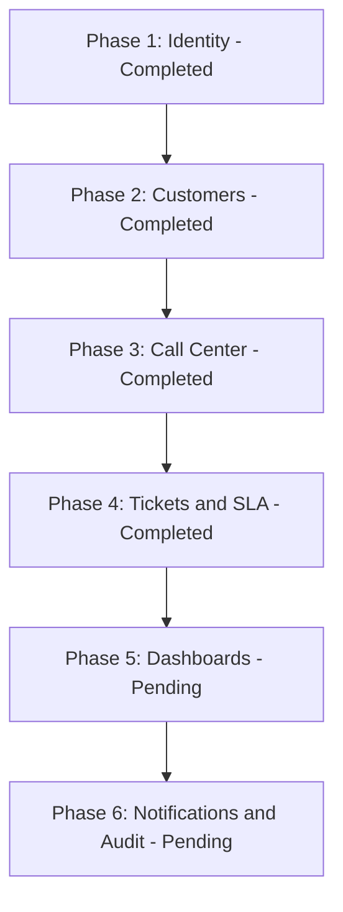

# تقرير تدقيق المشروع ومطابقة المتطلبات
## UniGroup CRM Platform — نسخة التدقيق بعد إنجاز 4 مراحل واختبارها

**تاريخ آخر تحديث:** 2 يوليو 2026 | **الحالة:** Phase 1 + Phase 2 + Phase 3 + Phase 4 — مكتملة ومختبرة ✅

---

## 1. ملخص تنفيذي (Executive Summary)

يوثق هذا التقرير نتائج التدقيق الشامل على نظام CRM المبني بـ **Clean Architecture + CQRS/MediatR + SQL Server**، بما يشمل:
- مطابقة المتطلبات الـ 18 مع ما تم برمجته فعلياً
- تدقيق هيكل قاعدة البيانات ومقارنته بـ `database_design.md`
- نتائج اختبار كل الـ Endpoints (26 اختبار للمراحل 2 و 3، إلى جانب سيناريوهات موديول التذاكر والـ SLA للمرحلة 4)
- المشاكل التي اكتُشفت وتم تصليحها
- الخطوات القادمة

**الخلاصة:** تم إنجاز المراحل 1 و 2 و 3 و 4 بنجاح، مع بناء موديول التذاكر ومسارات العمل واتفاقية مستوى الخدمة (SLA) وتكاملها بشكل كامل مع بقية أجزاء النظام وقاعدة البيانات.

---

## 2. تدقيق هيكل قاعدة البيانات (Database Schema Audit)

### الجداول الموجودة حالياً في SQL Server:

| الجدول | الكيان (Entity) | رابط الكيان | المرحلة | ملاحظات التدقيق |
|---|---|---|:-:|---|
| `Users` | `ApplicationUser` | [ApplicationUser.cs](file:///C:/Users/SMART%20HOME/Documents/Uni-Group/crm%20customer%20service/src/UniGroup.CRM.Domain/Entities/ApplicationUser.cs) | Phase 1 | ✅ يرث من `IdentityUser<Guid>` — Guid PK — حقول مخصصة: FirstName, LastName, IsActive, CreatedAt |
| `Roles` | `ApplicationRole` | [ApplicationRole.cs](file:///C:/Users/SMART%20HOME/Documents/Uni-Group/crm%20customer%20service/src/UniGroup.CRM.Domain/Entities/ApplicationRole.cs) | Phase 1 | ✅ يرث من `IdentityRole<Guid>` — إضافة حقل Description |
| `RefreshTokens` | `RefreshToken` | [RefreshToken.cs](file:///C:/Users/SMART%20HOME/Documents/Uni-Group/crm%20customer%20service/src/UniGroup.CRM.Domain/Entities/RefreshToken.cs) | Phase 1 | ✅ FK لـ Users — مقيد بـ IP Address — Cascade delete |
| `UserRoles` | ASP.NET Identity | — | Phase 1 | ✅ جدول الربط بين Users وRoles |
| `UserClaims` | ASP.NET Identity | — | Phase 1 | ✅ جزء من نظام Identity |
| `RoleClaims` | ASP.NET Identity | — | Phase 1 | ✅ جزء من نظام Identity |
| `UserLogins` | ASP.NET Identity | — | Phase 1 | ✅ جزء من نظام Identity |
| `UserTokens` | ASP.NET Identity | — | Phase 1 | ✅ جزء من نظام Identity |
| `Customers` | `Customer` | [Customer.cs](file:///C:/Users/SMART%20HOME/Documents/Uni-Group/crm%20customer%20service/src/UniGroup.CRM.Domain/Entities/Customer.cs) | Phase 2 | ✅ حقول: Id, Name, Email, Province, City, AddressDetails, CreatedAt |
| `CustomerPhones` | `CustomerPhone` | [CustomerPhone.cs](file:///C:/Users/SMART%20HOME/Documents/Uni-Group/crm%20customer%20service/src/UniGroup.CRM.Domain/Entities/CustomerPhone.cs) | Phase 2 | ✅ Unique Index على `Phone` — حقل `IsPrimary` للرقم الرئيسي |
| `DeviceBrands` | `DeviceBrand` | [DeviceBrand.cs](file:///C:/Users/SMART%20HOME/Documents/Uni-Group/crm%20customer%20service/src/UniGroup.CRM.Domain/Entities/DeviceBrand.cs) | Phase 2 | ✅ Unique Index على `Name` (أُضيف في Code Review) |
| `DeviceModels` | `DeviceModel` | [DeviceModel.cs](file:///C:/Users/SMART%20HOME/Documents/Uni-Group/crm%20customer%20service/src/UniGroup.CRM.Domain/Entities/DeviceModel.cs) | Phase 2 | ✅ Composite Unique Index على `(BrandId, Name)` (أُضيف في Code Review) |
| `CustomerDevices` | `CustomerDevice` | [CustomerDevice.cs](file:///C:/Users/SMART%20HOME/Documents/Uni-Group/crm%20customer%20service/src/UniGroup.CRM.Domain/Entities/CustomerDevice.cs) | Phase 2 | ✅ Filtered Unique Index على IMEI وSerialNumber يسمح بالـ Null |
| `Calls` | `Call` | [Call.cs](file:///C:/Users/SMART%20HOME/Documents/Uni-Group/crm%20customer%20service/src/UniGroup.CRM.Domain/Entities/Call.cs) | Phase 3 | ✅ FK Nullable للـ Customer (SetNull) — FK Required للـ Agent (Restrict) |
| `Departments` | `Department` | [Department.cs](file:///C:/Users/SMART%20HOME/Documents/Uni-Group/crm%20customer%20service/src/UniGroup.CRM.Domain/Entities/Department.cs) | Phase 4 | ✅ Unique Index على `Name` — حقول: Id, Name, Description, IsActive, CreatedAt |
| `Tickets` | `Ticket` | [Ticket.cs](file:///C:/Users/SMART%20HOME/Documents/Uni-Group/crm%20customer%20service/src/UniGroup.CRM.Domain/Entities/Ticket.cs) | Phase 4 | ✅ PK string readable format `T-YYYY-NNNNN` — FK Restrict لـ Customers, Users, Departments — FK SetNull لـ CustomerDevices — حقول SLA و ChatwootConversationId |
| `Attachments` | `Attachment` | [Attachment.cs](file:///C:/Users/SMART%20HOME/Documents/Uni-Group/crm%20customer%20service/src/UniGroup.CRM.Domain/Entities/Attachment.cs) | Phase 4 | ✅ FK Cascade لـ Tickets — FK Restrict لـ Users — حقول لرفع الملفات (StorageUrl) |
| `InternalNotes` | `InternalNote` | [InternalNote.cs](file:///C:/Users/SMART%20HOME/Documents/Uni-Group/crm%20customer%20service/src/UniGroup.CRM.Domain/Entities/InternalNote.cs) | Phase 4 | ✅ FK Cascade لـ Tickets — FK Restrict لـ Users — ملاحظات للموظفين فقط |
| `TicketHistories` | `TicketHistory` | [TicketHistory.cs](file:///C:/Users/SMART%20HOME/Documents/Uni-Group/crm%20customer%20service/src/UniGroup.CRM.Domain/Entities/TicketHistory.cs) | Phase 4 | ✅ FK Cascade لـ Tickets — FK Restrict لـ Users — تسجيل حركات وتوقيتات الحالة |

### الـ Migrations المطبقة بالترتيب:

| # | اسم الـ Migration | تاريخ التطبيق | ما تفعله |
|:-:|---|---|---|
| 1 | `InitialCreate` | 2026-07-01 | جداول ASP.NET Identity + RefreshTokens |
| 2 | `AddPhase2Entities` | 2026-07-01 | Customers + CustomerPhones + DeviceBrands + DeviceModels + CustomerDevices |
| 3 | `AddPhase3Calls` | 2026-07-01 | Calls + Indexes على PhoneNumber, CustomerId, AgentId |
| 4 | `AddUniqueIndexesForBrandAndModel` | 2026-07-01 | Unique Index على DeviceBrand.Name + Composite Index على DeviceModel(BrandId, Name) |
| 5 | `AddPhase4TicketsWorkflowsAndSla` | 2026-07-02 | جداول Departments, Tickets, Attachments, InternalNotes, TicketHistories وفهارسها |

### القيود الذكية المطبقة على DB (Fluent API Constraints):

```csharp
// Unique Phone per Customer
HasIndex(cp => cp.Phone).IsUnique()

// Filtered Unique IMEI (allows null/empty)
HasIndex(cd => cd.IMEI).IsUnique()
    .HasFilter("[IMEI] IS NOT NULL AND [IMEI] != ''")

// Filtered Unique SerialNumber (allows null/empty)
HasIndex(cd => cd.SerialNumber).IsUnique()
    .HasFilter("[SerialNumber] IS NOT NULL AND [SerialNumber] != ''")

// Unique Brand Name
HasIndex(db => db.Name).IsUnique()

// Unique Model per Brand (Composite)
HasIndex(dm => new { dm.BrandId, dm.Name }).IsUnique()

// Unique Department Name
HasIndex(d => d.Name).IsUnique()

// Ticket Indexes for performance
HasIndex(t => t.Status)
HasIndex(t => t.Priority)
HasIndex(t => t.SlaDeadline)
HasIndex(t => t.CreatedAt)
HasIndex(t => t.AssignedToId)
HasIndex(t => t.CustomerId)
```

---

## 3. مطابقة المتطلبات الـ 18 (Requirements Mapping Table)



### جدول مطابقة المتطلبات التفصيلي:

| م | المتطلب | الحالة | الجداول | المكون البرمجي | الملاحظات |
|:-:|---|:-:|---|---|---|
| 1 | **إدارة العملاء** | ✅ مكتمل | `Customers`, `CustomerPhones` | [CreateCustomerCommand.cs](file:///C:/Users/SMART%20HOME/Documents/Uni-Group/crm%20customer%20service/src/UniGroup.CRM.Application/Features/Customers/Commands/CreateCustomer/CreateCustomerCommand.cs) — [CustomersController.cs](file:///C:/Users/SMART%20HOME/Documents/Uni-Group/crm%20customer%20service/src/UniGroup.CRM.API/Controllers/CustomersController.cs) | تسجيل عملاء + رفض تكرار الهاتف + دعم هواتف متعددة |
| 2 | **إدارة مركز الاتصال** | ✅ مكتمل | `Calls` | [LogCallCommand.cs](file:///C:/Users/SMART%20HOME/Documents/Uni-Group/crm%20customer%20service/src/UniGroup.CRM.Application/Features/Calls/Commands/LogCall/LogCallCommand.cs) — [CallsController.cs](file:///C:/Users/SMART%20HOME/Documents/Uni-Group/crm%20customer%20service/src/UniGroup.CRM.API/Controllers/CallsController.cs) | تسجيل مكالمات Inbound/Outbound — AgentId من JWT |
| 3 | **إدارة الحالات والشكاوى** | ✅ مكتمل | `Tickets` | [CreateTicketCommand.cs](file:///C:/Users/SMART%20HOME/Documents/Uni-Group/crm%20customer%20service/src/UniGroup.CRM.Application/Features/Tickets/Commands/CreateTicket/CreateTicketCommand.cs) — [TicketsController.cs](file:///C:/Users/SMART%20HOME/Documents/Uni-Group/crm%20customer%20service/src/UniGroup.CRM.API/Controllers/TicketsController.cs) | إنشاء تذاكر برقم مقروء T-YYYY-NNNNN وربطها بالعميل والأجهزة |
| 4 | **الملف التعريفي للعميل 360°** | ✅ مكتمل | `Customers`, `CustomerPhones`, `CustomerDevices` | [GetCustomerDetailsQuery.cs](file:///C:/Users/SMART%20HOME/Documents/Uni-Group/crm%20customer%20service/src/UniGroup.CRM.Application/Features/Customers/Queries/GetCustomerDetails/GetCustomerDetailsQuery.cs) | يجلب الهواتف + الأجهزة + حالة الضمان |
| 5 | **رؤية العميل الموحدة (Caller ID)** | ✅ مكتمل | `Customers`, `CustomerPhones`, `CustomerDevices`, `Calls` | [GetCallerProfileQuery.cs](file:///C:/Users/SMART%20HOME/Documents/Uni-Group/crm%20customer%20service/src/UniGroup.CRM.Application/Features/Calls/Queries/GetCallerProfile/GetCallerProfileQuery.cs) | Caller ID فوري — يعرف العميل برقم هاتفه لحظة الاتصال |
| 6 | **تصنيفات الاتصال والحالات** | ✅ مكتمل | `Tickets` (أعمدة) | [CreateTicketCommand.cs](file:///C:/Users/SMART%20HOME/Documents/Uni-Group/crm%20customer%20service/src/UniGroup.CRM.Application/Features/Tickets/Commands/CreateTicket/CreateTicketCommand.cs) | تصنيف المشكلة عبر `TicketCategory` مع تحديد الأولوية وتاريخ SLA تلقائياً |
| 7 | **قاعدة المعرفة والتشخيص** | ⏳ لم يبدأ | `KnowledgeBase` (مخطط) | — | خطوات توجيهية للموظف |
| 8 | **دورة حياة التذكرة (State Machine)** | ✅ مكتمل | `Tickets`, `TicketHistories` | [TransitionTicketStatusCommand.cs](file:///C:/Users/SMART%20HOME/Documents/Uni-Group/crm%20customer%20service/src/UniGroup.CRM.Application/Features/Tickets/Commands/TransitionTicketStatus/TransitionTicketStatusCommand.cs) | 8 حالات مع محرك انتقال صارم وحساب أوقات البقاء وتسجيل السجل |
| 9 | **توجيه الحالات بين الإدارات** | ✅ مكتمل | `Tickets`, `Departments`, `TicketHistories` | [AssignTicketCommand.cs](file:///C:/Users/SMART%20HOME/Documents/Uni-Group/crm%20customer%20service/src/UniGroup.CRM.Application/Features/Tickets/Commands/AssignTicket/AssignTicketCommand.cs) — [DepartmentsController.cs](file:///C:/Users/SMART%20HOME/Documents/Uni-Group/crm%20customer%20service/src/UniGroup.CRM.API/Controllers/DepartmentsController.cs) | توجيه التذكرة لقسم أو موظف وتسجيل التحويلات |
| 10 | **إدارة التصعيد التلقائي** | ✅ مكتمل | `Tickets`, `TicketHistories` | [EscalateOverdueTicketsCommand.cs](file:///C:/Users/SMART%20HOME/Documents/Uni-Group/crm%20customer%20service/src/UniGroup.CRM.Application/Features/Tickets/Commands/EscalateOverdueTickets/EscalateOverdueTicketsCommand.cs) | تصعيد تلقائي في الخلفية بواسطة SlaMonitorService عند تجاوز Deadline |
| 11 | **اتفاقية مستوى الخدمة (SLA)** | ✅ مكتمل | `Tickets` | [TransitionTicketStatusCommand.cs](file:///C:/Users/SMART%20HOME/Documents/Uni-Group/crm%20customer%20service/src/UniGroup.CRM.Application/Features/Tickets/Commands/TransitionTicketStatus/TransitionTicketStatusCommand.cs) | إيقاف العداد عند الانتظار (Waiting) وإعادة التشغيل وحساب الموعد النهائي |
| 12 | **الملاحظات الداخلية والمرفقات** | ✅ مكتمل | `InternalNotes`, `Attachments` | [AddInternalNoteCommand.cs](file:///C:/Users/SMART%20HOME/Documents/Uni-Group/crm%20customer%20service/src/UniGroup.CRM.Application/Features/Tickets/Commands/AddInternalNote/AddInternalNoteCommand.cs) — [AddAttachmentCommand.cs](file:///C:/Users/SMART%20HOME/Documents/Uni-Group/crm%20customer%20service/src/UniGroup.CRM.Application/Features/Tickets/Commands/AddAttachment/AddAttachmentCommand.cs) | ملاحظات سرية للموظفين ومرفقات صور/PDF حد أقصى 10MB |
| 13 | **نظام البحث المتقدم** | ✅ مكتمل | `Customers`, `CustomerPhones`, `CustomerDevices` | [SearchSystemQuery.cs](file:///C:/Users/SMART%20HOME/Documents/Uni-Group/crm%20customer%20service/src/UniGroup.CRM.Application/Features/Calls/Queries/SearchSystem/SearchSystemQuery.cs) — [SearchController.cs](file:///C:/Users/SMART%20HOME/Documents/Uni-Group/crm%20customer%20service/src/UniGroup.CRM.API/Controllers/SearchController.cs) | بحث بالاسم + هاتف + IMEI + Serial |
| 14 | **لوحة التحكم والإحصائيات** | ⏳ لم يبدأ | — | — | مخطط للمرحلة 5 |
| 15 | **التقارير والتحليلات** | ⏳ لم يبدأ | — | — | مخطط للمرحلة 5 |
| 16 | **إشعارات والتنبيهات** | ⏳ لم يبدأ | — | — | مخطط للمرحلة 6 |
| 17 | **قياس رضا العملاء (CSAT)** | ⏳ لم يبدأ | `CsatSurveys` (مخطط) | — | مخطط للمرحلة 6 |
| 18 | **الصلاحيات والأدوار** | ✅ مكتمل | `Users`, `Roles` | [AuthController.cs](file:///C:/Users/SMART%20HOME/Documents/Uni-Group/crm%20customer%20service/src/UniGroup.CRM.API/Controllers/AuthController.cs) | JWT + Roles (Agent, Team Leader, Admin) |
| 19 | **سجل التدقيق (Audit Trail)** | ⏳ لم يبدأ | `AuditLogs` (مخطط) | — | مخطط للمرحلة 6 |

**ملخص:** 13 متطلب مكتمل ✅ — 6 متطلبات في الخطة ⏳

---

## 4. تدقيق منطق الضمان (Warranty Logic)

في [AddCustomerDeviceCommand.cs](file:///C:/Users/SMART%20HOME/Documents/Uni-Group/crm%20customer%20service/src/UniGroup.CRM.Application/Features/Devices/Commands/AddCustomerDevice/AddCustomerDeviceCommand.cs):

```csharp
// حساب تلقائي: إذا لم يُدخل تاريخ، يُضاف سنتان من تاريخ الشراء
var warrantyExpiry = request.WarrantyExpiry ?? request.PurchaseDate.AddYears(2);
```

في [GetCustomerDetailsQuery.cs](file:///C:/Users/SMART%20HOME/Documents/Uni-Group/crm%20customer%20service/src/UniGroup.CRM.Application/Features/Customers/Queries/GetCustomerDetails/GetCustomerDetailsQuery.cs):

```csharp
// حالة الضمان: Active أو Expired بمقارنة التاريخ الحالي
d.WarrantyExpiry > currentDate ? "Active" : "Expired"
```

**نتيجة الاختبار الفعلي:** شراء بتاريخ `2026-07-01` → Expiry يُحسب تلقائياً `2028-07-01` → Status: `Active` ✅

---

## 5. تدقيق الأمان (Security Audit)

| النقطة | الحالة | التفاصيل |
|---|:-:|---|
| AgentId من JWT Claims وليس Request Body | ✅ | `User.FindFirstValue(ClaimTypes.NameIdentifier)` في CallsController |
| كل الـ Endpoints محمية بـ `[Authorize]` | ✅ | AuthController فقط بدون Authorize |
| Unique constraints على مستوى DB | ✅ | لا يمكن تجاوزها حتى لو تجاوز الكود |
| Filtered Unique Indexes للـ NULL values | ✅ | يمنع أخطاء FK مع IMEI وSerial الاختياريين |
| DeleteBehavior.Restrict عند حذف Agent | ✅ | يحافظ على سجلات المكالمات |
| DeleteBehavior.SetNull عند حذف Customer | ✅ | يحافظ على المكالمات بدون ربط للعميل |

---

## 6. نتائج الاختبار الكامل (Full Test Results)

### Phase 2 — 16/16 اختبار ✅

| # | الاختبار | الـ Endpoint | النتيجة |
|:-:|---|---|:-:|
| T1 | Create Customer `Mohamed Hassan` | POST /api/customers | ✅ 201 |
| T2 | رفض هاتف مكرر `01234567890` | POST /api/customers | ✅ 400 |
| T3 | Get Customer 360° (Ahmed Walid) مع Warranty Active | GET /api/customers/{id} | ✅ 200 |
| T4 | Customer غير موجود | GET /api/customers/{id} | ✅ 404 |
| T5 | Search by Name `Ahmed` | GET /api/customers/search | ✅ 200 |
| T6 | Search by Phone `01234567890` | GET /api/customers/search | ✅ 200 |
| T7 | Create Brand `Nokia` | POST /api/devices/brands | ✅ 200 |
| T8 | رفض Brand `Samsung` مكرر | POST /api/devices/brands | ✅ 400 |
| T9 | Create Model `Nokia 3310` | POST /api/devices/models | ✅ 200 |
| T10 | رفض Model مكرر تحت نفس الماركة | POST /api/devices/models | ✅ 400 |
| T11 | Assign Device (auto-warranty +2 سنة) | POST /api/devices/assign | ✅ 200 |
| T12 | Get 360° بعد ربط الجهاز (Nokia 3310 + 2028) | GET /api/customers/{id} | ✅ 200 |
| T13 | رفض نفس IMEI لعميل آخر | POST /api/devices/assign | ✅ 400 |
| T14 | Search by IMEI `123456789012345` | GET /api/customers/search | ✅ 200 |
| T15 | Search by Serial `NK3310ABC001` | GET /api/customers/search | ✅ 200 |
| T16 | Search — لا نتائج | GET /api/customers/search | ✅ 200 (0 results) |

### Phase 3 — 10/10 اختبار ✅

| # | الاختبار | الـ Endpoint | النتيجة |
|:-:|---|---|:-:|
| T1 | Caller ID — رقم معروف (`01099999999` → Ali Walid) | GET /api/calls/caller-id | ✅ 200 + Profile |
| T2 | Caller ID — رقم مجهول (`01088888888`) | GET /api/calls/caller-id | ✅ 200 + null |
| T3 | Log Call — من عميل معروف | POST /api/calls | ✅ 201 |
| T4 | Log Call — `customerId = null` (بعد التصليح) | POST /api/calls | ✅ 201 |
| T5 | Call History للعميل Ahmed Walid | GET /api/calls/history/{id} | ✅ 200 |
| T6 | Unified Search بالاسم `Ahmed` | GET /api/search?q=Ahmed | ✅ 200 |
| T7 | Unified Search بالهاتف | GET /api/search?q=01012345678 | ✅ 200 |
| T8 | Unified Search بالـ IMEI | GET /api/search?q=359876543210777 | ✅ 200 + Device |
| T9 | Unified Search بالـ Serial | GET /api/search?q=S24U987654777 | ✅ 200 |
| T10 | Unified Search — لا نتائج | GET /api/search?q=XXXXXXXXX | ✅ 200 (0 results) |

---

## 7. مشاكل اكتُشفت وتم إصلاحها (Issues Found & Fixed)

| # | المشكلة | النوع | الملف | الإصلاح |
|:-:|---|---|---|---|
| 1 | `GetCallerProfileQuery`: `Select(p => p.Customer).Include(...)` — EF Core لا يضمن تطبيق Include بعد Select | 🔴 Critical Bug | GetCallerProfileQuery.cs | إعادة كتابة: `Customers.Where(c => c.CustomerPhones.Any(p => p.Phone == phone))` |
| 2 | `DeviceBrand.Name` بدون Unique Index على مستوى DB | 🟡 Data Integrity | ApplicationDbContext.cs | إضافة `HasIndex(db => db.Name).IsUnique()` |
| 3 | `DeviceModel` بدون Composite Unique Index على `(BrandId, Name)` | 🟡 Data Integrity | ApplicationDbContext.cs | إضافة `HasIndex(dm => new { dm.BrandId, dm.Name }).IsUnique()` |
| 4 | `LogCallCommand` مع `customerId = null` يرجع 500 — `CreatedAtAction` يفشل في توليد Route بـ null parameter | 🔴 Critical Bug | CallsController.cs | إضافة شرط: إذا `CustomerId == null` → `return Created($"/api/calls/{callId}", callId)` |

---

## 8. هيكل ملفات الكود الحالي (Codebase Structure)

```
src/
├── UniGroup.CRM.Domain/
│   ├── Entities/
│   │   ├── ApplicationUser.cs     ← Phase 1
│   │   ├── ApplicationRole.cs     ← Phase 1
│   │   ├── RefreshToken.cs        ← Phase 1
│   │   ├── Customer.cs            ← Phase 2
│   │   ├── CustomerPhone.cs       ← Phase 2
│   │   ├── DeviceBrand.cs         ← Phase 2
│   │   ├── DeviceModel.cs         ← Phase 2
│   │   ├── CustomerDevice.cs      ← Phase 2
│   │   ├── Call.cs                ← Phase 3
│   │   ├── Ticket.cs              ← Phase 4
│   │   ├── Department.cs          ← Phase 4
│   │   ├── TicketHistory.cs       ← Phase 4
│   │   ├── InternalNote.cs        ← Phase 4
│   │   └── Attachment.cs          ← Phase 4
│   └── Enums/
│       ├── CallDirection.cs       ← Phase 3
│       ├── TicketCategory.cs      ← Phase 4
│       ├── TicketStatus.cs        ← Phase 4
│       └── TicketPriority.cs      ← Phase 4
│
├── UniGroup.CRM.Application/
│   ├── Common/Interfaces/
│   │   ├── IApplicationDbContext.cs
│   │   ├── ITicketNumberGenerator.cs ← Phase 4
│   │   └── IFileStorageService.cs    ← Phase 4
│   └── Features/
│       ├── Auth/                                                   ← Phase 1
│       │   ├── Commands/
│       │   │   ├── Login/
│       │   │   │   └── LoginCommand.cs                             ← Phase 1
│       │   │   └── Register/
│       │   │       └── RegisterCommand.cs                          ← Phase 1
│       │   └── Common/
│       │       └── AuthResponse.cs                                 ← Phase 1
│       │
│       ├── Customers/                                              ← Phase 2
│       │   ├── Commands/
│       │   │   └── CreateCustomer/
│       │   │       └── CreateCustomerCommand.cs                    ← Phase 2
│       │   └── Queries/
│       │       ├── Common/                                         ← Phase 2
│       │       │   ├── CustomerDetailsDto.cs                       ← Phase 2
│       │       │   ├── CustomerDeviceDto.cs                        ← Phase 2
│       │       │   └── CustomerPhoneDto.cs                         ← Phase 2
│       │       ├── GetCustomerDetails/
│       │       │   └── GetCustomerDetailsQuery.cs                  ← Phase 2
│       │       └── SearchCustomers/
│       │           └── SearchCustomersQuery.cs                     ← Phase 2
│       │
│       ├── Devices/                                                ← Phase 2
│       │   └── Commands/
│       │       ├── AddCustomerDevice/
│       │       │   └── AddCustomerDeviceCommand.cs                 ← Phase 2
│       │       ├── CreateDeviceBrand/
│       │       │   └── CreateDeviceBrandCommand.cs                 ← Phase 2
│       │       └── CreateDeviceModel/
│       │           └── CreateDeviceModelCommand.cs                 ← Phase 2
│       │
│       ├── Calls/                                                  ← Phase 3
│       │   ├── Commands/
│       │   │   └── LogCall/
│       │   │       └── LogCallCommand.cs                           ← Phase 3
│       │   └── Queries/
│       │       ├── Common/                                         ← Phase 3
│       │       │   └── CallDto.cs                                  ← Phase 3
│       │       ├── GetCallHistory/
│       │       │   └── GetCallHistoryQuery.cs                      ← Phase 3
│       │       ├── GetCallerProfile/
│       │       │   └── GetCallerProfileQuery.cs                    ← Phase 3
│       │       └── SearchSystem/
│       │           └── SearchSystemQuery.cs                        ← Phase 3
│       │
│       ├── Tickets/                                                ← Phase 4
│       │   ├── Commands/
│       │   │   ├── CreateTicket/
│       │   │   │   └── CreateTicketCommand.cs                      ← Phase 4
│       │   │   ├── TransitionTicketStatus/
│       │   │   │   └── TransitionTicketStatusCommand.cs            ← Phase 4
│       │   │   ├── AssignTicket/
│       │   │   │   └── AssignTicketCommand.cs                      ← Phase 4
│       │   │   ├── AddInternalNote/
│       │   │   │   └── AddInternalNoteCommand.cs                   ← Phase 4
│       │   │   ├── AddAttachment/
│       │   │   │   └── AddAttachmentCommand.cs                     ← Phase 4
│       │   │   └── EscalateOverdueTickets/
│       │   │       └── EscalateOverdueTicketsCommand.cs            ← Phase 4
│       │   └── Queries/
│       │       ├── Common/
│       │       │   ├── TicketDetailsDto.cs                         ← Phase 4
│       │       │   └── TicketSummaryDto.cs                         ← Phase 4
│       │       ├── GetTicketDetails/
│       │       │   └── GetTicketDetailsQuery.cs                    ← Phase 4
│       │       ├── GetTicketsList/
│       │       │   └── GetTicketsListQuery.cs                      ← Phase 4
│       │       └── GetMyTickets/
│       │           └── GetMyTicketsQuery.cs                        ← Phase 4
│       │
│       └── Departments/                                            ← Phase 4
│           ├── Commands/
│           │   └── CreateDepartment/
│           │       └── CreateDepartmentCommand.cs                  ← Phase 4
│           └── Queries/
│               ├── Common/
│               │   └── DepartmentDto.cs                            ← Phase 4
│               └── GetDepartments/
│                   └── GetDepartmentsQuery.cs                      ← Phase 4
│
├── UniGroup.CRM.Infrastructure/
│   ├── Data/ApplicationDbContext.cs
│   ├── Services/
│   │   ├── JwtProvider.cs                  ← Phase 1
│   │   ├── TicketNumberGenerator.cs        ← Phase 4
│   │   ├── LocalFileStorageService.cs      ← Phase 4
│   │   └── SlaMonitorService.cs            ← Phase 4
│   ├── DependencyInjection.cs
│   └── Migrations/ (5 migrations)
│
└── UniGroup.CRM.API/
    ├── Controllers/
    │   ├── AuthController.cs      ← Phase 1
    │   ├── CustomersController.cs ← Phase 2
    │   ├── DevicesController.cs   ← Phase 2
    │   ├── CallsController.cs     ← Phase 3
    │   ├── SearchController.cs    ← Phase 3
    │   ├── TicketsController.cs   ← Phase 4
    │   └── DepartmentsController.cs ← Phase 4
    └── UniGroup.CRM.API.http      ← Test file (26 tests)
```

---

## 9. الخطوات القادمة وتوصيات التدقيق

### المرحلة الخامسة (Dashboards & Reports):

**الـ DTOs والمؤشرات المطلوبة:**
* `DashboardSummaryDto`: التذاكر الجديدة اليوم، التذاكر المفتوحة، التذاكر المتجاوزة لـ SLA، حجم المكالمات اليومي، نسبة الالتزام بالـ SLA.
* `AgentPerformanceDto`: إجمالي التذاكر المغلقة لكل موظف، متوسط زمن الحل، معدل الالتزام بـ SLA، متوسط تقييم CSAT.
* `DeviceFailureReportDto`: الماركة والموديل الأكثر عطلاً، نوع العطل المتكرر، عدد العملاء المتكررين.
* `HourlyCallVolumeDto`: توزيع المكالمات على مدار الـ 24 ساعة.

**الـ Queries والاستعلامات (Application Layer):**
1. `GetDashboardSummaryQuery`
2. `GetAgentPerformanceQuery`
3. `GetDeviceFailureReportQuery`
4. `GetHourlyCallVolumeQuery`
5. `GetTicketsByStatusQuery`
6. `ExportAgentReportQuery` (CSV Export)

**التوصيات والبنية التحتية (Infrastructure):**
1. استخدام **HybridCache** (مع Redis) بمدد صلاحية مناسبة (60 ثانية للوحة الرئيسية، 5 دقائق للتقارير) لمنع إرهاق قاعدة البيانات وضمان سرعة الاستجابة (أقل من 200ms).
2. بناء **SQL Views** للتقارير الإحصائية الثقيلة (مثل `vw_AgentPerformance`) واستدعائها عبر EF Core لتسريع الاستعلام.
3. دعم الفلترة الزمنية والـ Pagination في استعلامات الموظفين والعملاء.

